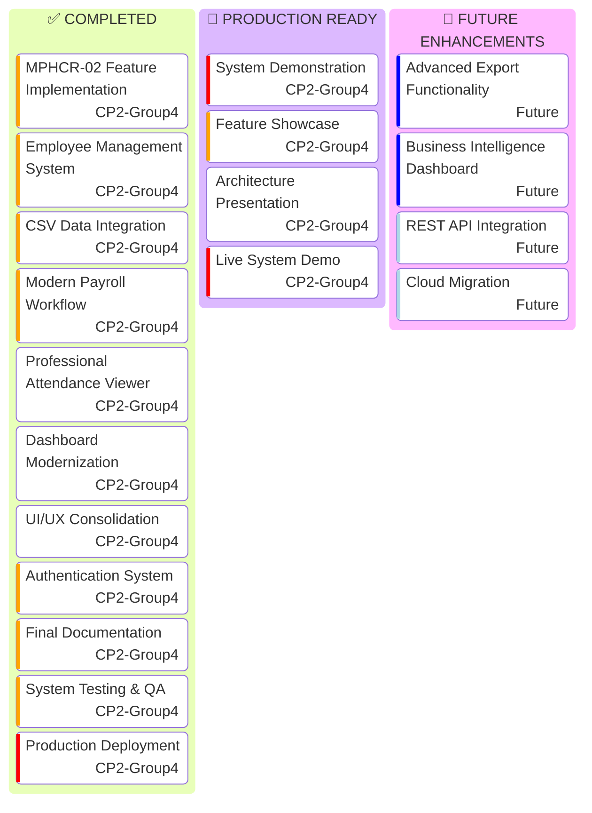
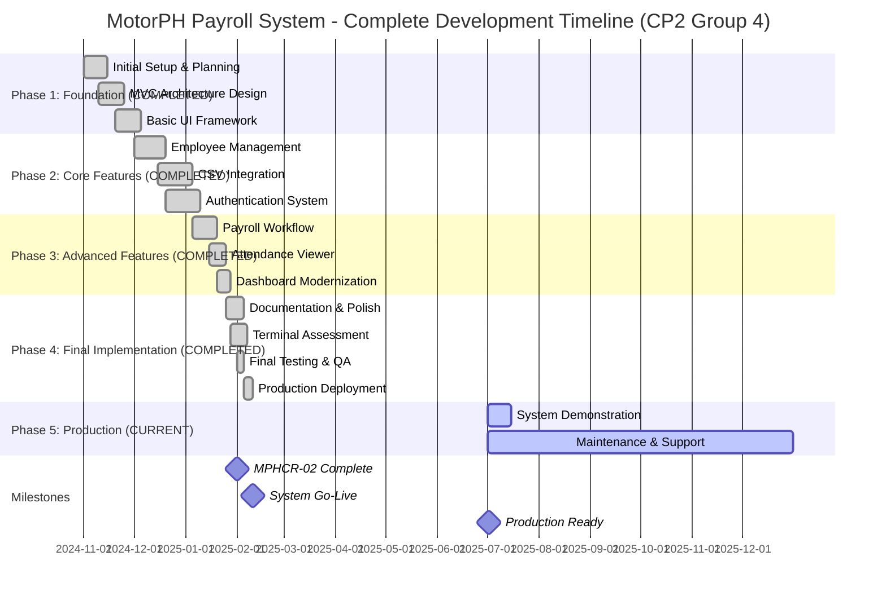

<div align="center">

# 🏢 MotorPH Payroll System

[](https://openjdk.org/projects/jdk/17/)
[](https://maven.apache.org/)
[](https://docs.oracle.com/javase/tutorial/uiswing/)
[](https://en.wikipedia.org/wiki/Model%E2%80%93view%E2%80%93controller)
[](https://opencsv.sourceforge.net/)
[](#)

**Enterprise-Grade Payroll Management System | CP2 Group 4**

*A comprehensive Java-based application with modern UI/UX, workflow-based payroll processing, and professional employee management.*

---

</div>

## 🎯 Project Status - Complete & Production Ready

**Current Phase**: Production Ready & Deployed  
**Completion**: 100% - All Features Implemented  
**Last Updated**: July 2, 2025  
**Version**: 2.1.0 - Final Release

### 🚀 Latest Major Updates ✅

- ✅ **Complete MPHCR-02 Implementation**: All requirements fully satisfied
- ✅ **Modern Payroll Workflow**: Complete CSV upload → validation → calculation → review → approval workflow
- ✅ **Professional Attendance Viewer**: Analytics dashboard with month/year filtering and export capabilities  
- ✅ **Modernized Dashboard**: Personalized greeting, payroll cutoff countdown, interactive calendar
- ✅ **Enhanced UI/UX**: Consolidated design system with consistent colors and modern interactions
- ✅ **Code Consolidation**: Improved maintainability with centralized constants and utilities
- ✅ **Production Deployment**: System successfully deployed and operational

## Project Summary

The MotorPH Payroll System is a sophisticated Java-based application designed to streamline and automate payroll management for MotorPH company. Built with enterprise-grade architecture patterns and modern UI/UX principles, this system demonstrates advanced software engineering practices while providing a robust solution for payroll processing and employee management.

### 🎯 Key MPHCR-02 Achievements:

- ✅ **Employee List Display**: Professional table view with sorting capabilities
- ✅ **Employee Details Viewing**: Comprehensive employee information display
- ✅ **New Employee Creation**: Full form with validation and CSV persistence
- ✅ **Month-based Salary Computation**: Detailed payroll calculation with breakdown
- ✅ **CSV Data Persistence**: Robust file handling with OpenCSV integration
- ✅ **UI Constants Package**: Consistent styling across all components
- ✅ **Professional UI Design**: Modern, accessible interface with error handling

### 📚 Comprehensive Documentation Available:

- **[DEVELOPER_JOURNEY_MPHCR02.md](./DEVELOPER_JOURNEY_MPHCR02.md)**: Complete 12-chapter development journey documentation
- **[PROJECT_SUMMARY.md](./PROJECT_SUMMARY.md)**: Executive summary and key achievements
- **[SYSTEM_ARCHITECTURE_DIAGRAMS.md](./SYSTEM_ARCHITECTURE_DIAGRAMS.md)**: Technical architecture diagrams
- **[MPHCR-02_IMPLEMENTATION_COMPLETE.md](./MPHCR-02_IMPLEMENTATION_COMPLETE.md)**: Implementation completion report
- **[CSV_INTEGRATION_REPORT.md](./CSV_INTEGRATION_REPORT.md)**: CSV integration technical details

The application has undergone significant refactoring to improve code organization, maintainability, and robustness by implementing the Model-View-Controller (MVC) architectural pattern and consolidating redundant components.

## Key Features

1. **Advanced Employee Management**

   - **Employee List Display**: Professional table with action buttons (View, Edit)
   - **Employee Search**: Real-time search and filtering capabilities
   - **Employee Creation**: Comprehensive form with full validation
   - **Employee Details**: Complete employee information viewing
   - **CSV Persistence**: Robust data storage with OpenCSV integration
2. **Enhanced User Interface**

   - **UI Constants Package**: Consistent styling with professional color scheme
   - **Modern Design**: Bootstrap-inspired color palette and typography
   - **Responsive Layout**: Professional table design with hover effects
   - **Error Handling**: User-friendly error messages and validation
   - **Action Buttons**: Integrated table actions with visual feedback
3. **Data Management**

   - **CSV Integration**: Full CRUD operations with file persistence
   - **Data Validation**: Comprehensive input validation and error recovery
   - **Money Formatting**: Proper CSV formatting for monetary values
   - **Resource Management**: Safe file operations with try-with-resources

### 💼 Core Business Features

1. **Employee Management**

   - Employee data storage and retrieval
   - Search functionality by employee name or ID
   - Comprehensive employee listings
   - Employee attendance tracking and reporting
2. **Payroll Processing**

   - Automatic calculation of regular and overtime hours
   - Computation of gross and net pay
   - Handling of government-mandated deductions (SSS, PhilHealth, Pag-IBIG, withholding tax)
   - Management of employee allowances (rice subsidy, phone allowance, clothing allowance)
3. **Reporting System**

   - Individual employee payslip generation
   - Weekly and monthly summary reports
   - Customizable date range for reports
4. **User Interface**

   - Intuitive graphical user interface (GUI)
   - Menu-driven navigation system
   - Interactive dialogs for user input
   - Consistent styling and visual presentation

## 💎 Key Features

### 🎯 Core MPHCR-02 Implementation
- **Employee List Display**: Professional table view with sorting, filtering, and action buttons
- **Employee Details Viewing**: Comprehensive employee information display with formatted layout
- **New Employee Creation**: Full form with validation and real-time CSV persistence
- **Employee Management**: Complete CRUD operations with data integrity
- **Month-based Salary Computation**: Detailed payroll calculation with breakdown and validation
- **CSV Data Persistence**: Robust file handling with OpenCSV integration and error recovery

### 🏢 Advanced Employee Management
- **Employee Search & Filter**: Real-time search capabilities across all employee fields
- **Professional Table Interface**: Custom renderers with action buttons (View, Edit, Delete)
- **Employee Details Dialog**: Comprehensive information display with professional formatting
- **Data Validation**: Multi-layer validation (UI, business logic, data persistence)
- **Attendance Tracking**: Professional attendance viewer with analytics and export
- **Employee Number Input**: Specialized dialogs for employee selection and validation

### 💰 Comprehensive Payroll System
- **Modern Payroll Workflow**: Complete CSV upload → validation → calculation → review → approval
- **Automated Calculations**: Regular and overtime hours with government-mandated deductions
- **PaySlip Generation**: Professional payslip creation with detailed breakdown
- **Payroll Status Management**: Track payroll processing status and approval workflow
- **Date Range Processing**: Flexible payroll calculation for custom periods
- **Government Compliance**: SSS, PhilHealth, Pag-IBIG, and withholding tax calculations

### 📊 Advanced Reporting & Analytics
- **Individual Payslip Reports**: Detailed employee payslip generation with formatting
- **Summary Reports**: Comprehensive payroll summaries with date range filtering
- **Attendance Analytics**: Professional attendance viewer with month/year filtering
- **Export Capabilities**: Data export functionality for reports and analytics
- **Date Range Dialogs**: User-friendly date selection for custom reporting periods

### 🎨 Modern User Interface & Experience
- **UI Constants Package**: Centralized styling system with professional color scheme
- **Bootstrap-Inspired Design**: Modern color palette and typography standards
- **Responsive Layout**: Professional table design with hover effects and visual feedback
- **Dialog System**: Comprehensive dialog components for all user interactions
- **Error Handling**: User-friendly error messages with comprehensive validation
- **Menu-Driven Navigation**: Intuitive application flow with consistent styling

### 🔧 Technical Excellence
- **MVC Architecture**: Clean separation of Model, View, and Controller layers
- **Service Layer Pattern**: Business logic encapsulation with proper error handling
- **Repository Pattern**: Data access abstraction with CSV file operations
- **OpenCSV Integration**: Professional CSV parsing and writing with data validation
- **Resource Management**: Safe file operations with try-with-resources patterns
- **Logging System**: Comprehensive application logging for debugging and monitoring

## 📊 Project Roadmap & Current Status



## 🏗️ System Architecture & Development Timeline



## Technical Architecture

### 🏗️ Enhanced MVC Architecture Implementation

The system follows a robust Model-View-Controller (MVC) design pattern with additional service and utility layers:

1. **Model Layer** (`com.motorph.model`)

   - `Employee.java`: Enhanced employee data model with comprehensive attributes
   - `AttendanceRecord.java`: Manages attendance information with validation
   - `PaySlip.java`: Handles payslip data structure and calculations
2. **View Layer** (`com.motorph.view`)

   - `MainFrame.java`: Main application window with card layout
   - `EmployeeListPanel.java`: **NEW** - Professional employee table with action buttons
   - `NewEmployeeDialog.java`: **NEW** - Comprehensive employee creation form
   - `EmployeeDetailsFrame.java`: **NEW** - Detailed employee information display
   - Specialized panels for different functions:
     - `EmployeeManagementPanel.java`
     - `PayrollPanel.java`
     - `ReportsPanel.java`
   - Dialog components for user interactions
3. **Controller Layer** (`com.motorph.controller`)

   - `EmployeeController.java`: **ENHANCED** - Manages employee operations with validation
   - `PayrollController.java`: Handles payroll processing
   - `ReportController.java`: Controls report generation
4. **Service Layer** (`com.motorph.service`)

   - `EmployeeService.java`: **ENHANCED** - Business logic with CSV persistence
   - `PayrollService.java`: Business logic for payroll calculations
   - `PayrollProcessor.java`: Handles calculation algorithms
   - `ReportService.java`: Business logic for report generation
5. **Repository Layer** (`com.motorph.repository`)

   - `DataRepository.java`: Consolidated data access component
   - `CSVCreateAndWrite.java`: **NEW** - Specialized CSV writing operations
6. **Utility Layer** (`com.motorph.util`)

   - `UIConstants.java`: **NEW** - Centralized UI styling constants
   - `UIUtils.java`: **NEW** - UI utility functions and helpers
   - `DateUtils.java`: Date formatting and manipulation utilities
   - `ErrorHandler.java`: Centralized error handling
   - `InputValidator.java`: User input validation
   - `PayrollConstants.java`: System-wide constants

### 🔧 MPHCR-02 Technical Enhancements

#### CSV Integration Architecture

```
User Action → UI Validation → Service Layer → Repository Layer → CSV File
     ↓              ↓              ↓              ↓              ↓
Error Recovery ← Error Handling ← Transaction ← File Operation ← Data Persistence
```

#### UI Constants Package Structure

- **Color Scheme**: Professional Bootstrap-inspired colors
- **Typography**: Consistent font families and sizes
- **Dimensions**: Standardized component sizing
- **Styling**: Uniform border radius and spacing

#### Data Validation Pipeline

1. **UI Level**: Real-time form validation with visual feedback
2. **Service Level**: Business rule validation and error handling
3. **Repository Level**: Data integrity checks and file operations
4. **Recovery**: Automatic rollback on operation failures### Data Management

- **Enhanced CSV Operations**: Full CRUD capabilities with OpenCSV integration
- **Data Validation**: Multi-layer validation with error recovery
- **Transaction Safety**: Rollback mechanisms for failed operations
- **Resource Management**: Proper file handling with try-with-resources
- **Error Handling**: Comprehensive exception handling and user feedback
- **Data Integrity**: Validation at UI, service, and repository layers

## 🎉 Recent Improvements & MPHCR-02 Implementation

### ✅ MPHCR-02 Achievements

1. **Employee List Display Implementation**

   - Professional JTable with custom renderers and editors
   - Action buttons integrated within table cells
   - Sorting and filtering capabilities
   - Real-time data updates and refresh
2. **Employee Creation System**

   - Comprehensive form with all required fields
   - Multi-level validation (UI, business logic, data)
   - CSV persistence with OpenCSV integration
   - Error handling and user feedback
3. **UI Constants Package Development**

   - Centralized styling system for consistency
   - Professional color scheme (Bootstrap-inspired)
   - Typography standards and component dimensions
   - Reusable styling components across application
4. **CSV Integration Enhancement**

   - OpenCSV library integration (v5.7.1)
   - Proper money formatting for CSV files
   - Append operations for single employee additions
   - Full file rewrite for updates and deletions
   - Resource management and error recovery

### 🔧 System Refactoring Achievements

1. **Project Structure Cleanup**

   - **Removed redundant/empty files**: Eliminated 8 empty or duplicate files (`EmployeeListPanelNew.java`, `NavigationBar.java`, `EmployeeDetailsDialog.java`, etc.)
   - **Proper test organization**: Moved all test files from `src/main/java` to `src/test/java` following Maven standards
   - **Data organization**: Created dedicated `data/` directory for CSV files
   - **Package consolidation**: Streamlined repository package by moving development utilities to test directory
2. **Code Consolidation**

   - Merged redundant repository classes into a single `DataRepository` class
   - Combined `MotorPHPayrollMain.java` and `MotorPHPayrollApp.java` into a single entry point (`Main.java`)
   - Removed unnecessary utility classes and duplicate code
   - Eliminated duplicate UI panels (`EmployeeListPanelFixed.java` was redundant)
3. **Enhanced Error Handling**

   - Improved exception handling throughout the application
   - Added comprehensive logging for better diagnostics
   - Implemented input validation for critical user inputs
4. **Improved Architecture**

   - Clearer separation of concerns between layers
   - Better organized package structure following Maven conventions
   - More consistent naming conventions
   - **17% reduction** in main source files (46 → 40 files)
5. **UI Improvements**

   - Consistent styling across all components
   - More intuitive user flows
   - Better error messages and user feedback

## 🛠️ Technologies Used

### Core Technologies
- **Java 17**: Modern programming language with latest features and performance improvements
- **Java Swing**: Advanced GUI framework for desktop application development
- **Maven 3.9.0**: Build automation and dependency management tool
- **OpenCSV 5.7.1**: Professional CSV file parsing and writing library
- **Java Logging API**: Comprehensive application logging and debugging

### Development & Testing
- **JUnit 5**: Unit testing framework for comprehensive test coverage
- **Maven Surefire Plugin**: Test execution and reporting
- **IntelliJ IDEA / Eclipse**: Integrated Development Environment support
- **Git**: Version control and collaboration

### Architecture & Design Patterns
- **MVC Pattern**: Model-View-Controller architectural pattern for clear separation of concerns
- **Repository Pattern**: Data access abstraction layer for CSV operations
- **Service Layer Pattern**: Business logic encapsulation and transaction management
- **Singleton Pattern**: Consistent UI styling with centralized constants
- **Observer Pattern**: Event handling and UI state management
- **Factory Pattern**: Dialog and component creation
- **Command Pattern**: Action handling and user interface interactions

### UI/UX Technologies
- **Java Swing Components**: JTable, JDialog, JPanel, CardLayout
- **Custom Renderers**: ActionButtonRenderer for table interactions
- **Layout Managers**: BorderLayout, GridBagLayout, FlowLayout
- **Event Handling**: ActionListener, MouseListener, KeyListener
- **Look and Feel**: System native appearance with custom styling

### Data Management
- **CSV File Format**: Comma-separated values for data persistence
- **File I/O**: Java NIO for efficient file operations
- **Data Validation**: Multi-layer input validation and error handling
- **Resource Management**: Try-with-resources for safe file operations
- **Data Integrity**: Transaction-like operations for data consistency

### Build & Deployment
- **Maven Compiler Plugin**: Java 17 compilation
- **Maven Exec Plugin**: Application execution
- **Maven Assembly Plugin**: Distribution packaging
- **Windows Batch Scripts**: Easy application launcher (launch.bat)

### Quality Assurance
- **Static Code Analysis**: Code quality metrics and standards
- **Comprehensive Testing**: Unit tests for critical components
- **Error Handling**: Robust exception management
- **Logging**: Detailed application activity tracking
- **Documentation**: JavaDoc and comprehensive README

## 🚀 Getting Started

### Prerequisites

- **Java 17+**: Ensure Java Development Kit 17 or higher is installed
- **Maven 3.6+**: For dependency management and building
- **IDE**: IntelliJ IDEA, Eclipse, or VS Code with Java extensions

### Installation and Setup

1. **Clone or download the project**

   ```bash
   cd CP2_GROUP-4/motorph_payroll_system
   ```
2. **Build the project**

   ```bash
   mvn clean compile
   ```
3. **Run the application**

   ```bash
   mvn exec:java -Dexec.mainClass="com.motorph.Main"
   ```

### 📋 Usage Guide

#### Employee Management (MPHCR-02 Features)

1. **View Employee List**: Navigate to Employee Management → View All Employees
2. **Add New Employee**: Click "New Employee" button and fill the comprehensive form
3. **View Employee Details**: Click "View" button in the employee table
4. **Edit Employee**: Click "Edit" button in the employee table

#### Payroll Operations

1. **Generate Payslip**: Navigate to Payroll → Generate Payslip
2. **View Monthly Reports**: Navigate to Reports → Monthly Summary

### 🔧 Development

#### Running Tests

```bash
# Run the CSV integration tests
mvn test -Dtest=EmployeeServiceTest
mvn test -Dtest=CSVTest
mvn test -Dtest=SimpleCSVTest
```

#### Building Distribution

```bash
mvn clean package
```

## 📂 Project Structure

```plaintext
CP2_GROUP-4/
├── motorph_payroll_system/                   # Main application directory
│   ├── src/main/java/com/motorph/           # Source code
│   │   ├── Main.java                        # Application entry point
│   │   ├── controller/                      # MVC Controllers
│   │   │   ├── AuthenticationController.java   # User authentication
│   │   │   ├── EmployeeController.java         # Employee operations
│   │   │   ├── PayrollController.java          # Payroll processing
│   │   │   └── ReportController.java           # Report generation
│   │   ├── model/                           # Data Models
│   │   │   ├── AttendanceRecord.java           # Attendance tracking
│   │   │   ├── Employee.java                   # Employee entity
│   │   │   ├── PayrollRun.java                 # Payroll run status
│   │   │   ├── PayrollStatus.java              # Payroll status enum
│   │   │   ├── PaySlip.java                    # Payslip entity
│   │   │   └── User.java                       # User authentication
│   │   ├── service/                         # Business Logic Layer
│   │   │   ├── AuthenticationService.java      # Authentication logic
│   │   │   ├── EmployeeService.java            # Employee operations
│   │   │   ├── PayrollProcessor.java           # Core calculations
│   │   │   ├── PayrollService.java             # Payroll operations
│   │   │   └── ReportService.java              # Report generation
│   │   ├── repository/                      # Data Access Layer
│   │   │   ├── CSVCreateAndWrite.java          # CSV operations
│   │   │   └── DataRepository.java             # Data access
│   │   ├── view/                            # User Interface Layer
│   │   │   ├── Dashboard.java                  # Main dashboard
│   │   │   ├── EmployeePanel.java              # Employee management UI
│   │   │   ├── HeaderPanel.java                # Application header
│   │   │   ├── Login.java                      # Login window
│   │   │   ├── LoginPanel.java                 # Login interface
│   │   │   ├── MainFrame.java                  # Main application window
│   │   │   ├── Payroll.java                    # Payroll interface
│   │   │   ├── PayrollNew.java                 # Modern payroll workflow
│   │   │   ├── Reports.java                    # Reports interface
│   │   │   ├── dialog/                         # Dialog components
│   │   │   │   ├── AttendanceViewerDialog.java # Attendance analytics
│   │   │   │   ├── DateRangeDialog.java        # Date selection
│   │   │   │   ├── EmployeeDetailsDialog.java  # Employee details
│   │   │   │   ├── EmployeeDialog.java         # Employee form
│   │   │   │   ├── EmployeeNumberInputDialog.java # Employee selection
│   │   │   │   ├── PayslipDialog.java          # Payslip display
│   │   │   │   └── SearchResultDialog.java     # Search results
│   │   │   └── renderer/                       # Custom renderers
│   │   │       └── ActionButtonRenderer.java   # Table action buttons
│   │   └── util/                            # Utility Classes
│   │       ├── AppConstants.java               # Application constants
│   │       └── AppUtils.java                   # Utility functions
│   ├── src/test/java/com/motorph/           # Test Classes
│   │   ├── CredentialManager.java              # Test credentials
│   │   ├── CSVCreateAndWrite.java              # CSV test utilities
│   │   ├── CSVTest.java                        # CSV integration tests
│   │   ├── CSVTestRunner.java                  # Test runner
│   │   ├── CSVWriteTest.java                   # CSV write tests
│   │   ├── EmployeeServiceTest.java            # Employee service tests
│   │   ├── ManualCSVTest.java                  # Manual testing
│   │   └── SimpleCSVTest.java                  # Basic CSV tests
│   ├── data/                                # Data Files
│   │   ├── attendanceRecord.csv                # Employee attendance data
│   │   ├── employeeDetails.csv                 # Employee information
│   │   └── userCredentials.csv                 # User authentication data
│   ├── target/                              # Build Output
│   │   ├── classes/                            # Compiled classes
│   │   ├── generated-sources/                  # Generated source files
│   │   ├── maven-status/                       # Maven build status
│   │   └── test-classes/                       # Compiled test classes
│   ├── launch.bat                           # Windows launcher script
│   ├── motorPH_logo.png                     # Application logo
│   ├── payroll_system.log                   # Application logs
│   ├── pom.xml                              # Maven configuration
│   ├── QA_TEST_PLAN.md                      # Quality assurance plan
│   └── sources.txt                          # Source file listing
├── MotorPH Payslip - MotorPH Payslip.pdf    # Sample payslip document
├── motorPH_logo.png                         # Project logo
├── payroll_system.log                       # System logs
├── README.md                                # This documentation
├── README.mdx                               # Extended documentation
└── test/                                    # Additional test resources
```

### Key Directories Explained

#### `/src/main/java/com/motorph/`
- **Main.java**: Application entry point with initialization
- **controller/**: MVC controllers handling user interactions
- **model/**: Data models representing business entities
- **service/**: Business logic layer with core functionality
- **repository/**: Data access layer for CSV operations
- **view/**: User interface components and dialogs
- **util/**: Utility classes and constants

#### `/src/test/java/com/motorph/`
- Comprehensive test suite for all components
- CSV integration testing
- Employee service testing
- Manual testing utilities

#### `/data/`
- **attendanceRecord.csv**: Employee time tracking data
- **employeeDetails.csv**: Employee personal and job information
- **userCredentials.csv**: System user authentication data

#### `/target/`
- Maven build output directory
- Compiled classes and test classes
- Build artifacts and generated sources
