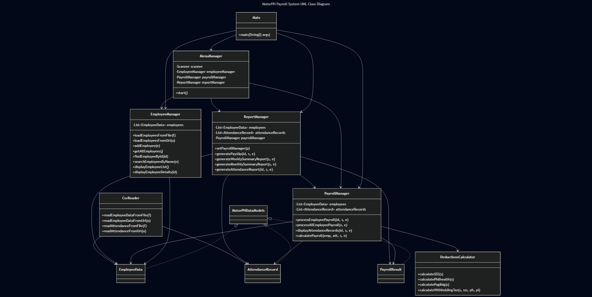

# MotorPH Payroll System

## Overview

The MotorPH Payroll System is a comprehensive Java application designed to manage employee information, calculate payroll, and generate reports for MotorPH company. This system provides an easy-to-use interface for HR personnel to process payroll efficiently and accurately.

## Features

- **Employee Management**

  - Search for employees by name or ID
  - View complete employee listings
  - Track employee attendance records
- **Payroll Processing**

  - Generate payroll for all employees within a date range
  - Process individual employee payslips
  - Calculate regular and overtime pay
  - Pro-rate allowances based on working days
- **Report Generation**

  - Detailed employee payslips
  - Weekly summary reports
  - Monthly summary reports

## Technical Details

- Written in Java (Java 17+)
- Maven project
- Fetches data from online CSV sources or local files
- Calculates various deductions (SSS, PhilHealth, Pag-IBIG, Withholding Tax)
- Handles allowances (rice subsidy, phone allowance, clothing allowance)
- Processes overtime with 1.25x rate
- Supports flexible date parsing
- Provides user-friendly console interface

## Requirements

- Java 17 or higher
- Maven
- Internet connection to access online employee and attendance data (optional)

## How to Use

1. Compile and run the Java application using Maven:
   ```sh
   mvn compile
   mvn exec:java -Dexec.mainClass="com.motorph.original.Main"
   ```
2. Navigate the menu using the number keys:
   - 1: Employee Management
   - 2: Payroll Management
   - 3: Reports
   - 4: Exit

### Generating a Payslip

1. Select "Payroll Management" → "Custom Payroll" or "Reports" → "Payslip"
2. Enter the employee number
3. Enter the date range for the payslip
4. Review the detailed breakdown

### Viewing Attendance

1. Select "Employee Management" → "Attendance"
2. Enter the employee number
3. Enter the date range
4. Review the attendance records

## Data Sources

The application retrieves data from the following sources:

- Employee Data: Google Sheets CSV export or local CSV file
- Attendance Records: Google Sheets CSV export or local CSV file

## Project Structure

- `src/main/java/com/motorph/original/`
  - `Main.java`: Main application class
  - `EmployeeManager.java`: Employee management logic
  - `PayrollManager.java`: Payroll calculation logic
  - `ReportManager.java`: Report generation logic
  - `MenuManager.java`: Console menu interface
  - `DeductionsCalculator.java`: Handles deductions and taxes
  - `CsvReader.java`: Reads employee and attendance data from CSV
  - `MotorPHDataModels.java`: Data models for employees, attendance, and payroll

## Contributors

- MotorPH Group 1

## Version

1.0 - Initial Release (March 2025)

## UML Class Diagram




[![img](https://mermaid.ink/img/pako:eNq9ll9v2jAQwL9K5KdUBQQUBIumSS202qQyVbCq0sYevOSaWHXsyHamZR397HMICXZwqu5lQRDs-9n3x_adn1HII0AB6vf7W6aIohB4K664uPvo3eFCcEq9TSEVpN796tZbUCyltyQ4Fjjdsv2osOxrujz97Hu8FSbMe656yuc81R3-RgnC4m_fPSxieVZJd9YwYPkKMxyDMEf3NyFmTPfJ6m1IrtOM8gKgHgV22yAPHtVgZjUNbg0ZF6rGhNky_JEKC-W7fGhbZPpxS6R6qYElVvilMVgak1OOo5qSN4KnN4SC_3j2GnIvqJ-bBI4awAdTEIO6pLQZ7JuyR8KaUVfFp8gnkSmWgEWYNEOvis84BZ-ZSERkRnFRM6XH_ivyJShMqDzqsWLZWrN_D2WFXSoFLMIshDWEXEQvHm71mNHPBA9Bynrugw3awp4ne54VygNqhLOm2-TB7bYl0jltiGmYU6ya2bRnvdJmC7UiZe_a_xKot54ovWuUjfqZvR_1ka6clZRkzojUzAPAEy02eZpiUVQ--13sijOVvBU2Pd-DLSusYC8hykNFOJOLw0pxK-bHBdxsNr50L21CaAKYqqQLwDH5QeIO6QNRScJppPPpF_yrdEtK_ZMl-ktcNi_kzzXgyN4c5wKOaaTcG-5k46JO8k0JHaPYPZHNmNPYpaAqRKW6lS5TVNZ2O5NtiZn97Y3sSCprkDlVleBU2fs_g4Fj9g7Qra4Ddukvy2W__8EsgC3JtauwNdI7x9lrhOvTGmYW2u7ZW5BTSYtx6GoXRFPfMbKtZPJmyB16B-gIu4NyHe0KtjNsVzxOqVMvThm3E50aTR-O59qtzJa3FaEeSkHoy1mk74H7A7ZFKoEUtijQfyMsnrZoy3aaw7nim4KFKFAihx4SPI8TFDxiKnUrzyKdlQ43wRrJMPvKedOMRanmMFqbAWLBc6ZQcDEa7mEUPKNfKBiPhoPZdDLSb_0ZzcbjHipQMJkPhpPpxXQyv5jNRpPpdLrrod_7-YeD-Ww61M94OpxNLubjdz0EEdFrt6quuPub7u4vIJ-OaQ?type=png)](https://mermaid.live/edit#pako:eNq9ll9v2jAQwL9K5KdUBQQUBIumSS202qQyVbCq0sYevOSaWHXsyHamZR397HMICXZwqu5lQRDs-9n3x_adn1HII0AB6vf7W6aIohB4K664uPvo3eFCcEq9TSEVpN796tZbUCyltyQ4Fjjdsv2osOxrujz97Hu8FSbMe656yuc81R3-RgnC4m_fPSxieVZJd9YwYPkKMxyDMEf3NyFmTPfJ6m1IrtOM8gKgHgV22yAPHtVgZjUNbg0ZF6rGhNky_JEKC-W7fGhbZPpxS6R6qYElVvilMVgak1OOo5qSN4KnN4SC_3j2GnIvqJ-bBI4awAdTEIO6pLQZ7JuyR8KaUVfFp8gnkSmWgEWYNEOvis84BZ-ZSERkRnFRM6XH_ivyJShMqDzqsWLZWrN_D2WFXSoFLMIshDWEXEQvHm71mNHPBA9Bynrugw3awp4ne54VygNqhLOm2-TB7bYl0jltiGmYU6ya2bRnvdJmC7UiZe_a_xKot54ovWuUjfqZvR_1ka6clZRkzojUzAPAEy02eZpiUVQ--13sijOVvBU2Pd-DLSusYC8hykNFOJOLw0pxK-bHBdxsNr50L21CaAKYqqQLwDH5QeIO6QNRScJppPPpF_yrdEtK_ZMl-ktcNi_kzzXgyN4c5wKOaaTcG-5k46JO8k0JHaPYPZHNmNPYpaAqRKW6lS5TVNZ2O5NtiZn97Y3sSCprkDlVleBU2fs_g4Fj9g7Qra4Ddukvy2W__8EsgC3JtauwNdI7x9lrhOvTGmYW2u7ZW5BTSYtx6GoXRFPfMbKtZPJmyB16B-gIu4NyHe0KtjNsVzxOqVMvThm3E50aTR-O59qtzJa3FaEeSkHoy1mk74H7A7ZFKoEUtijQfyMsnrZoy3aaw7nim4KFKFAihx4SPI8TFDxiKnUrzyKdlQ43wRrJMPvKedOMRanmMFqbAWLBc6ZQcDEa7mEUPKNfKBiPhoPZdDLSb_0ZzcbjHipQMJkPhpPpxXQyv5jNRpPpdLrrod_7-YeD-Ww61M94OpxNLubjdz0EEdFrt6quuPub7u4vIJ-OaQ)
