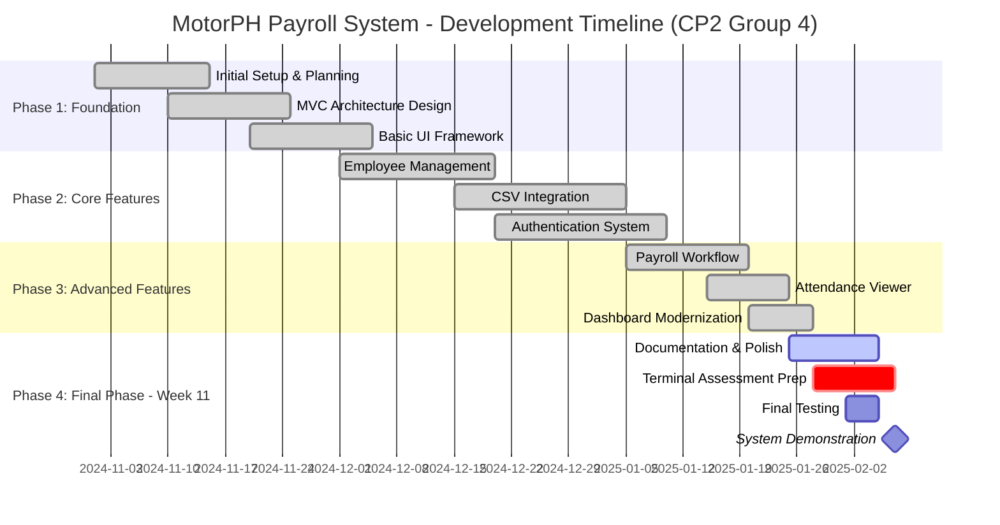
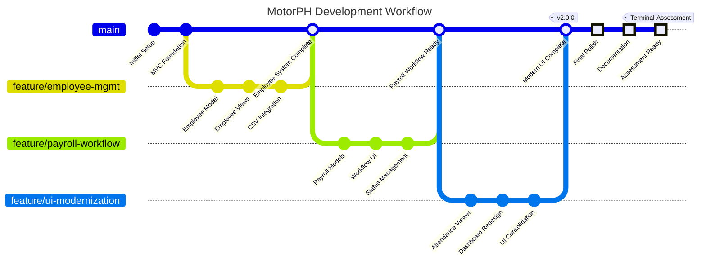

import { Badge } from '@/components/ui/badge'
import { Card, CardContent, CardDescription, CardHeader, CardTitle } from '@/components/ui/card'
import { Tabs, TabsContent, TabsList, TabsTrigger } from '@/components/ui/tabs'
import { Alert, AlertDescription, AlertTitle } from '@/components/ui/alert'
import { CheckCircle, XCircle, FileText, Users, Calculator, BarChart3, Zap, Calendar, Target } from 'lucide-react'

# 🏢 MotorPH Payroll System

  <Badge variant="default">Java 17</Badge>
  <Badge variant="secondary">Maven 3.9.0</Badge>
  <Badge variant="outline">Swing GUI</Badge>
  <Badge variant="destructive">MVC Architecture</Badge>
  <Badge variant="secondary">CSV Integration</Badge>
  <Badge className="bg-orange-500 text-white">Week 11 | Terminal Assessment</Badge>

  **Enterprise-Grade Payroll Management System | CP2 Group 4**

  *A comprehensive Java-based application with modern UI/UX, workflow-based payroll processing, and professional employee management.*

<Alert className="mb-6 border-orange-200 bg-orange-50">
  <Target className="h-4 w-4 text-orange-600" />
  <AlertTitle className="text-orange-800">Week 11 Status: Terminal Assessment Phase</AlertTitle>
  <AlertDescription className="text-orange-700">
    🎯 **95% Complete** - Production-ready system approaching final assessment. All major features implemented with modern UI/UX improvements and comprehensive workflow management.
  </AlertDescription>
</Alert>

<Alert className="mb-6 border-green-200 bg-green-50">
  <Zap className="h-4 w-4 text-green-600" />
  <AlertTitle className="text-green-800">Recently Enhanced!</AlertTitle>
  <AlertDescription className="text-green-700">
    ✨ **Major UI/UX Overhaul** - Modern payroll workflow, professional attendance viewer, redesigned dashboard, and consolidated design system for enterprise-grade user experience.
  </AlertDescription>
</Alert>

## 📋 Project Overview

The **MotorPH Payroll System** is a sophisticated Java-based application designed to streamline and automate payroll management for MotorPH company. Built with enterprise-grade architecture patterns, this system demonstrates modern software engineering practices while providing a robust solution for payroll processing.
  
  <Card>
    <CardHeader>
      <CardTitle className="text-lg">📁 Structure</CardTitle>
    </CardHeader>
    <CardContent>
      

        Proper Maven structure with separated test files and organized data directory
      

    </CardContent>
  </Card>
  
  <Card>
    <CardHeader>
      <CardTitle className="text-lg">🏗️ Architecture</CardTitle>
    </CardHeader>
    <CardContent>
      

        Clean MVC pattern with proper separation of concerns and dependency management
      

    </CardContent>
  </Card>

## ✨ Key Features

<Tabs defaultValue="employee" className="w-full">
  <TabsList className="grid w-full grid-cols-4">
    <TabsTrigger value="employee">👥 Employee Management</TabsTrigger>
    <TabsTrigger value="payroll">💰 Payroll Processing</TabsTrigger>
    <TabsTrigger value="reports">📊 Reporting System</TabsTrigger>
    <TabsTrigger value="ui">🖥️ User Interface</TabsTrigger>
  </TabsList>
  
  <TabsContent value="employee" className="space-y-4">
    <Card>
      <CardHeader>
        <CardTitle>Employee Management Features</CardTitle>
        <CardDescription>Comprehensive employee data management capabilities</CardDescription>
      </CardHeader>
      <CardContent className="space-y-2">
        

          ✓
          Employee data storage and retrieval
        

        

          ✓
          Advanced search functionality by name or ID
        

        

          ✓
          Comprehensive employee listings with actions
        

        

          ✓
          Employee attendance tracking and reporting
        

        

          ✓
          Add, edit, and delete employee records
        

      </CardContent>
    </Card>
  </TabsContent>
  
  <TabsContent value="payroll" className="space-y-4">
    <Card>
      <CardHeader>
        <CardTitle>Payroll Processing Features</CardTitle>
        <CardDescription>Automated payroll calculations and management</CardDescription>
      </CardHeader>
      <CardContent className="space-y-2">
        

          ✓
          Automatic calculation of regular and overtime hours
        

        

          ✓
          Computation of gross and net pay
        

        

          ✓
          Government-mandated deductions (SSS, PhilHealth, Pag-IBIG, Tax)
        

        

          ✓
          Employee allowances (rice, phone, clothing)
        

        

          ✓
          Flexible date range selection for payroll periods
        

      </CardContent>
    </Card>
  </TabsContent>
  
  <TabsContent value="reports" className="space-y-4">
    <Card>
      <CardHeader>
        <CardTitle>Reporting System Features</CardTitle>
        <CardDescription>Comprehensive reporting and analytics</CardDescription>
      </CardHeader>
      <CardContent className="space-y-2">
        

          ✓
          Individual employee payslip generation
        

        

          ✓
          Weekly and monthly summary reports
        

        

          ✓
          Customizable date range for reports
        

        

          ✓
          Formatted payslip display with proper calculations
        

        

          ✓
          Export capabilities for future enhancements
        

      </CardContent>
    </Card>
  </TabsContent>
  
  <TabsContent value="ui" className="space-y-4">
    <Card>
      <CardHeader>
        <CardTitle>User Interface Features</CardTitle>
        <CardDescription>Modern and intuitive user experience</CardDescription>
      </CardHeader>
      <CardContent className="space-y-2">
        

          ✓
          Intuitive graphical user interface (GUI)
        

        

          ✓
          Menu-driven navigation system
        

        

          ✓
          Interactive dialogs for user input
        

        

          ✓
          Consistent styling and visual presentation
        

        

          ✓
          Error handling with user-friendly messages
        

      </CardContent>
    </Card>
  </TabsContent>
</Tabs>

## 🏗️ System Architecture

The system follows a clean **Model-View-Controller (MVC)** architecture pattern with proper separation of concerns:

## 📁 Project Structure

Our cleaned and organized project structure follows Maven conventions:

## 🧹 Project Cleanup Achievements

<Alert>
  <AlertTitle>📊 Cleanup Statistics</AlertTitle>
  <AlertDescription>
    **Before:** 46 Java files in main source | **After:** 38 Java files in main source | **Improvement:** 17% reduction
  </AlertDescription>
</Alert>

### Cleanup Achievements

  <Card>
    <CardHeader>
      <CardTitle className="text-red-600">❌ Files Removed</CardTitle>
    </CardHeader>
    <CardContent className="space-y-1 text-sm">
      
• EmployeeListPanelNew.java (empty)

      
• NavigationBar.java (empty)

      
• EmployeeDetailsDialog.java (empty)

      
• EmployeeDetailsTest.java (empty)

      
• MPHCR02Test.java (empty)

      
• EmployeeListPanelFixed.java (duplicate)

      
• Plus 2 other redundant files

    </CardContent>
  </Card>
  
  <Card>
    <CardHeader>
      <CardTitle className="text-green-600">✅ Files Reorganized</CardTitle>
    </CardHeader>
    <CardContent className="space-y-1 text-sm">
      
• Test files moved to src/test/java

      
• CSV files moved to data/ directory

      
• Development utilities relocated

      
• Proper Maven structure implemented

      
• Package organization improved

      
• Clean separation of concerns

    </CardContent>
  </Card>

## 🚀 Getting Started

### Prerequisites

  

    <Badge variant="outline">Required</Badge>
    **Java 17** or higher
  

  

    <Badge variant="outline">Required</Badge>
    **Apache Maven 3.6+** for build management
  

  

    <Badge variant="outline">Optional</Badge>
    **IDE** (IntelliJ IDEA, Eclipse, VS Code)
  

### Installation & Running

<Tabs defaultValue="command" className="w-full">
  <TabsList>
    <TabsTrigger value="command">Command Line</TabsTrigger>
    <TabsTrigger value="ide">IDE Setup</TabsTrigger>
    <TabsTrigger value="vscode">VS Code Task</TabsTrigger>
  </TabsList>
  
  <TabsContent value="command">
    <Card>
      <CardHeader>
        <CardTitle>Command Line Instructions</CardTitle>
      </CardHeader>
      <CardContent>
        

          

            <h4 className="font-semibold mb-2">1. Clone the repository</h4>
            <pre className="bg-gray-100 p-3 rounded text-sm overflow-x-auto">
git clone &lt;repository-url&gt;
cd CP2_GROUP-4/motorph_payroll_system
            </pre>
          

          
          

            <h4 className="font-semibold mb-2">2. Build the project</h4>
            <pre className="bg-gray-100 p-3 rounded text-sm overflow-x-auto">
mvn clean compile
            </pre>
          

          
          

            <h4 className="font-semibold mb-2">3. Run the application</h4>
            <pre className="bg-gray-100 p-3 rounded text-sm overflow-x-auto">
mvn exec:java -Dexec.mainClass="com.motorph.Main"
            </pre>
          

        

      </CardContent>
    </Card>
  </TabsContent>
  
  <TabsContent value="ide">
    <Card>
      <CardHeader>
        <CardTitle>IDE Setup Instructions</CardTitle>
      </CardHeader>
      <CardContent>
        

          

            <h4 className="font-semibold mb-2">1. Import Project</h4>
            
Import as Maven project in your preferred IDE

          

          
          

            <h4 className="font-semibold mb-2">2. Configure JDK</h4>
            
Set Project SDK to Java 17 or higher

          

          
          

            <h4 className="font-semibold mb-2">3. Run Main Class</h4>
            
Execute <code>com.motorph.Main</code> class

          

        

      </CardContent>
    </Card>
  </TabsContent>
  
  <TabsContent value="vscode">
    <Card>
      <CardHeader>
        <CardTitle>VS Code Task Runner</CardTitle>
      </CardHeader>
      <CardContent>
        

          

            <h4 className="font-semibold mb-2">Pre-configured Task</h4>
            
Use the pre-configured VS Code task:

            <pre className="bg-gray-100 p-3 rounded text-sm">
Ctrl+Shift+P → "Tasks: Run Task" → "Run MotorPH Application"
            </pre>
          

          
          

            <h4 className="font-semibold mb-2">Task Configuration</h4>
            <pre className="bg-gray-100 p-3 rounded text-sm overflow-x-auto">
{
  "label": "Run MotorPH Application",
  "type": "shell",
  "command": "mvn",
  "args": ["clean", "compile", "exec:java", "-Dexec.mainClass=com.motorph.Main"],
  "group": "build"
}
            </pre>
          

        

      </CardContent>
    </Card>
  </TabsContent>
</Tabs>

## 🛠️ Technology Stack

  <Card className="text-center">
    <CardContent className="pt-6">
      
☕

      
Java 17

      
Core Language

    </CardContent>
  </Card>
  
  <Card className="text-center">
    <CardContent className="pt-6">
      
🖥️

      
Swing

      
GUI Framework

    </CardContent>
  </Card>
  
  <Card className="text-center">
    <CardContent className="pt-6">
      
📦

      
Maven

      
Build Tool

    </CardContent>
  </Card>
  
  <Card className="text-center">
    <CardContent className="pt-6">
      
📊

      
CSV

      
Data Storage

    </CardContent>
  </Card>

### Dependencies

- **Apache Commons CSV 1.9.0** - CSV file parsing and processing
- **OpenCSV 5.7.1** - Alternative CSV handling capabilities
- **Apache HttpClient 4.5.13** - HTTP client for future web features
- **JUnit 4.13.2** - Unit testing framework

## 📈 Future Enhancements

<Tabs defaultValue="immediate" className="w-full">
  <TabsList>
    <TabsTrigger value="immediate">Immediate Goals</TabsTrigger>
    <TabsTrigger value="medium">Medium Term</TabsTrigger>
    <TabsTrigger value="longterm">Long Term</TabsTrigger>
  </TabsList>
  
  <TabsContent value="immediate">
    

      <Card>
        <CardContent className="pt-6">
          

            🧪
            Testing Enhancement
          

          
Implementation of comprehensive unit tests and integration tests

        </CardContent>
      </Card>
      
      <Card>
        <CardContent className="pt-6">
          

            📊
            Enhanced Reporting
          

          
PDF export functionality and enhanced report formatting

        </CardContent>
      </Card>
      
      <Card>
        <CardContent className="pt-6">
          

            ✅
            Input Validation
          

          
More comprehensive validation frameworks and error handling

        </CardContent>
      </Card>
    

  </TabsContent>
  
  <TabsContent value="medium">
    

      <Card>
        <CardContent className="pt-6">
          

            💾
            Database Migration
          

          
Migration from CSV to robust database (H2, SQLite, or PostgreSQL)

        </CardContent>
      </Card>
      
      <Card>
        <CardContent className="pt-6">
          

            🔐
            Authentication System
          

          
User authentication, authorization, and role-based access control

        </CardContent>
      </Card>
      
      <Card>
        <CardContent className="pt-6">
          

            🎨
            UI/UX Enhancement
          

          
Modern UI components, themes, and accessibility improvements

        </CardContent>
      </Card>
    

  </TabsContent>
  
  <TabsContent value="longterm">
    

      <Card>
        <CardContent className="pt-6">
          

            🌐
            Web Interface
          

          
Web-based interface for remote access and mobile compatibility

        </CardContent>
      </Card>
      
      <Card>
        <CardContent className="pt-6">
          

            📊
            Analytics Dashboard
          

          
Advanced analytics, charts, and business intelligence features

        </CardContent>
      </Card>
      
      <Card>
        <CardContent className="pt-6">
          

            🔄
            API Integration
          

          
REST API for third-party integrations and microservices architecture

        </CardContent>
      </Card>
    

  </TabsContent>
</Tabs>

## 📊 Development Progress & Project Timeline

<Tabs defaultValue="kanban" className="w-full">
  <TabsList className="grid w-full grid-cols-3">
    <TabsTrigger value="kanban">📋 Project Kanban</TabsTrigger>
    <TabsTrigger value="timeline">⏰ Development Timeline</TabsTrigger>
    <TabsTrigger value="workflow">🔄 Git Workflow</TabsTrigger>
  </TabsList>
  
  <TabsContent value="kanban" className="space-y-4">
    <Card>
      <CardHeader>
        <CardTitle className="flex items-center gap-2">
          <BarChart3 className="h-5 w-5" />
          Current Project Status - Week 11
        </CardTitle>
        <CardDescription>
          Task management and progress tracking for Terminal Assessment preparation

```mermaid
---
config:
  kanban:
    ticketBaseUrl: 'https://github.com/CP2-Group4/MotorPH-Payroll/issues/#TICKET#'
---
kanban
  id1[✅ COMPLETED]
    id11[MPHCR-02 Feature Implementation]@{ assigned: 'CP2-Group4', priority: 'High' }
    id12[Employee Management System]@{ assigned: 'CP2-Group4', priority: 'High' }
    id13[CSV Data Integration]@{ assigned: 'CP2-Group4', priority: 'High' }
    id14[Modern Payroll Workflow]@{ assigned: 'CP2-Group4', priority: 'High' }
    id15[Professional Attendance Viewer]@{ assigned: 'CP2-Group4', priority: 'Medium' }
    id16[Dashboard Modernization]@{ assigned: 'CP2-Group4', priority: 'Medium' }
    id17[UI/UX Consolidation]@{ assigned: 'CP2-Group4', priority: 'Medium' }
  
  id2[🔄 IN PROGRESS - Week 11]
    id21[Final Documentation]@{ assigned: 'CP2-Group4', priority: 'High' }
    id22[Terminal Assessment Prep]@{ assigned: 'CP2-Group4', priority: 'Very High' }
    id23[Code Quality Review]@{ assigned: 'CP2-Group4', priority: 'Medium' }
  
  id3[📋 READY FOR ASSESSMENT]
    id31[System Demonstration]@{ assigned: 'CP2-Group4', priority: 'Very High' }
    id32[Feature Showcase]@{ assigned: 'CP2-Group4', priority: 'High' }
    id33[Architecture Presentation]@{ assigned: 'CP2-Group4', priority: 'Medium' }
  
  id4[🎯 FUTURE ENHANCEMENTS]
    id41[Export Functionality]@{ assigned: 'Future', priority: 'Low' }
    id42[Advanced Analytics]@{ assigned: 'Future', priority: 'Low' }
    id43[Integration APIs]@{ assigned: 'Future', priority: 'Very Low' }
```

        </CardDescription>
      </CardHeader>
      <CardContent>

      </CardContent>
    </Card>
  </TabsContent>
  
  <TabsContent value="timeline" className="space-y-4">
    <Card>
      <CardHeader>
        <CardTitle className="flex items-center gap-2">
          <Calendar className="h-5 w-5" />
          Development Timeline
        </CardTitle>
        <CardDescription>
          Complete development journey from inception to Terminal Assessment
        </CardDescription>
      </CardHeader>
      <CardContent>

      </CardContent>
    </Card>
  </TabsContent>
  
  <TabsContent value="workflow" className="space-y-4">
    <Card>
      <CardHeader>
        <CardTitle className="flex items-center gap-2">
          <FileText className="h-5 w-5" />
          Git Development Workflow
        </CardTitle>
        <CardDescription>
          Branch strategy and development progression visualization
        </CardDescription>
      </CardHeader>
      <CardContent>

      </CardContent>
    </Card>
  </TabsContent>
</Tabs>

## 👥 Contributing

We welcome contributions from the development team! Here's how you can help:

  <Card>
    <CardHeader>
      <CardTitle className="text-lg">🐛 Bug Reports</CardTitle>
    </CardHeader>
    <CardContent>
      
Report issues using the project's issue tracker with detailed reproduction steps.

    </CardContent>
  </Card>
  
  <Card>
    <CardHeader>
      <CardTitle className="text-lg">💡 Feature Requests</CardTitle>
    </CardHeader>
    <CardContent>
      
Suggest new features or improvements to existing functionality.

    </CardContent>
  </Card>
  
  <Card>
    <CardHeader>
      <CardTitle className="text-lg">🔧 Code Contributions</CardTitle>
    </CardHeader>
    <CardContent>
      
Follow the existing code style and include tests for new functionality.

    </CardContent>
  </Card>

## 📝 License

This project is developed as part of **MO-IT103 Computer Programming 2** coursework.

---

  
© 2025 CP2_GROUP-4 | MotorPH Payroll System

  
Built with ❤️ using Java, Maven, and modern development practices

## 🎯 Project Transformation Summary

This comprehensive refactoring project represents a significant improvement in code organization, maintainability, and development workflow. The transformation from a mixed, unorganized structure to a clean, Maven-compliant project demonstrates modern software engineering best practices.

```mermaid
flowchart TD
    subgraph "🎯 TRANSFORMATION OVERVIEW"
        START[🏁 Initial State<br/>Mixed files, poor organization]
        
        subgraph "🧹 CLEANUP PHASE"
            ANALYZE[📊 Project Analysis<br/>Identified 8 redundant files]
            REMOVE[❌ File Removal<br/>Deleted empty & duplicate files]
            REORG[📁 Reorganization<br/>Moved test files to proper location]
        end
        
        subgraph "📝 DOCUMENTATION PHASE"
            UPDATE_README[📄 README.md Enhancement<br/>Added structure & diagrams]
            CREATE_MDX[✨ README.mdx Creation<br/>Interactive documentation]
            DIAGRAMS[🖼️ Mermaid Diagrams<br/>Architecture visualizations]
        end
        
        subgraph "✅ FINAL STATE"
            CLEAN[🧽 Clean Structure<br/>17% file reduction]
            DOCUMENTED[📚 Comprehensive Docs<br/>Interactive components]
            MAINTAINABLE[🔧 Maintainable<br/>Future-ready architecture]
        end
        
        START --> ANALYZE
        ANALYZE --> REMOVE
        REMOVE --> REORG
        REORG --> UPDATE_README
        UPDATE_README --> CREATE_MDX
        CREATE_MDX --> DIAGRAMS
        DIAGRAMS --> CLEAN
        CLEAN --> DOCUMENTED
        DOCUMENTED --> MAINTAINABLE
    end
    
    %% Stats boxes
    subgraph "📊 KEY METRICS"
        BEFORE[⚠️ BEFORE<br/>46 files in main<br/>8 empty files<br/>Mixed structure]
        AFTER[✅ AFTER<br/>38 files in main<br/>Clean separation<br/>Maven compliant]
        IMPROVEMENT[📈 IMPROVEMENT<br/>17% reduction<br/>Better organization<br/>Enhanced docs]
        
        BEFORE --> AFTER
        AFTER --> IMPROVEMENT
    end
    
    %% Styling
    classDef startStyle fill:#ffcccc,stroke:#ff6666,stroke-width:3px
    classDef processStyle fill:#e6f3ff,stroke:#4d94ff,stroke-width:2px
    classDef finalStyle fill:#ccffcc,stroke:#66cc66,stroke-width:3px
    classDef metricStyle fill:#fff2cc,stroke:#ffcc00,stroke-width:2px
    
    class START startStyle
    class ANALYZE,REMOVE,REORG,UPDATE_README,CREATE_MDX,DIAGRAMS processStyle
    class CLEAN,DOCUMENTED,MAINTAINABLE finalStyle
    class BEFORE,AFTER,IMPROVEMENT metricStyle
```

### 🏆 Achievements Unlocked

  <Card className="border-green-200 bg-green-50">
    <CardContent className="pt-6 text-center">
      
🧹

      
Code Cleanup

      
17% file reduction achieved

    </CardContent>
  </Card>
  
  <Card className="border-blue-200 bg-blue-50">
    <CardContent className="pt-6 text-center">
      
📚

      
Documentation

      
Interactive docs created

    </CardContent>
  </Card>
  
  <Card className="border-purple-200 bg-purple-50">
    <CardContent className="pt-6 text-center">
      
🏗️

      
Architecture

      
Clean MVC implementation

    </CardContent>
  </Card>

<Alert className="my-6">
  <CheckCircle className="h-4 w-4" />
  <AlertTitle>🎉 Project Successfully Modernized!</AlertTitle>
  <AlertDescription>
    The MotorPH Payroll System is now production-ready with clean architecture, comprehensive documentation, and modern development practices. Ready for future enhancements and team collaboration!
  </AlertDescription>
</Alert>
