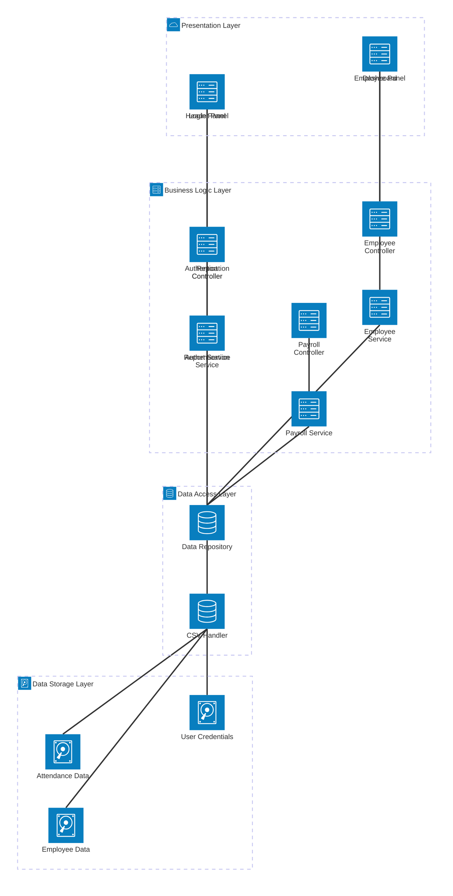
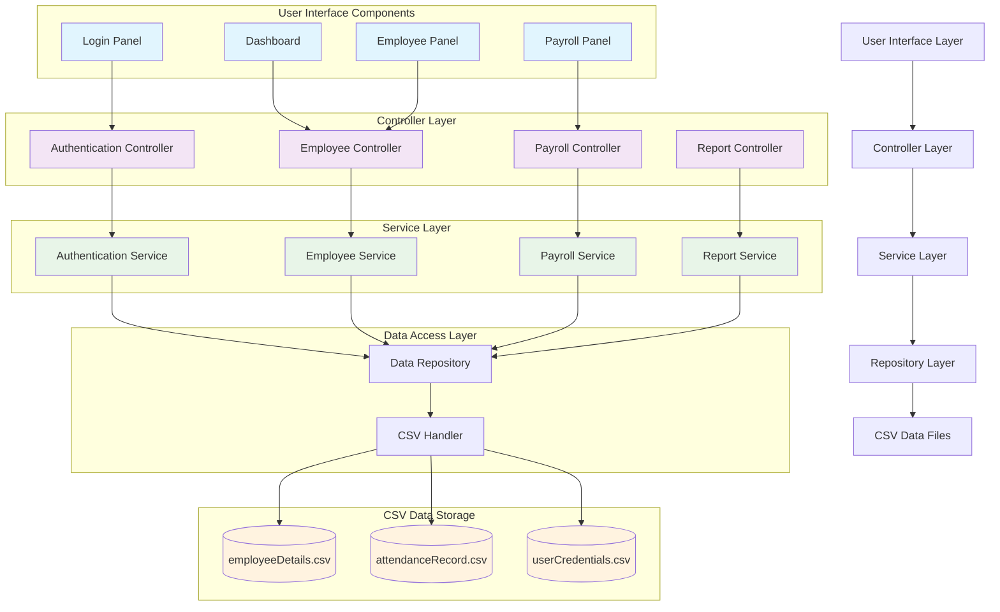
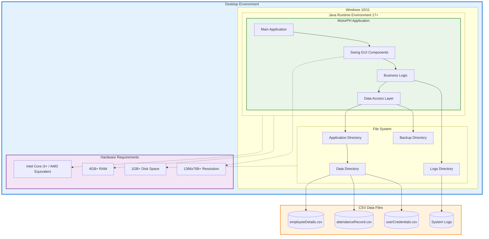
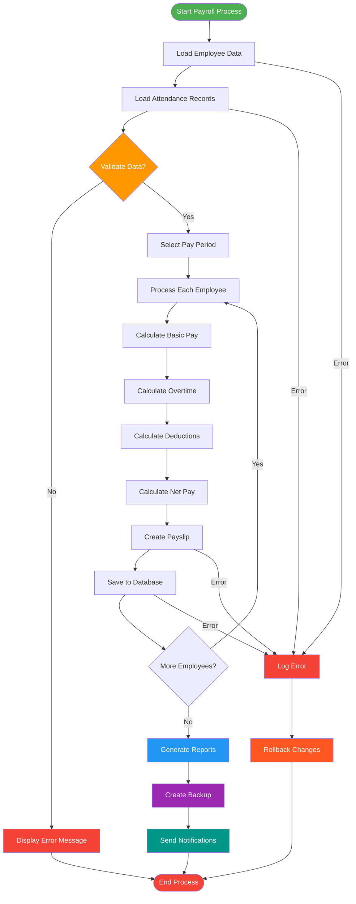
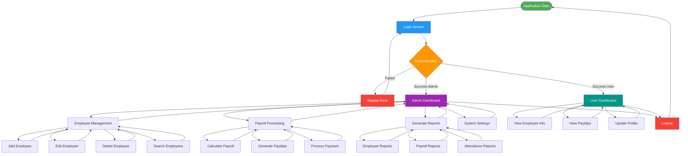
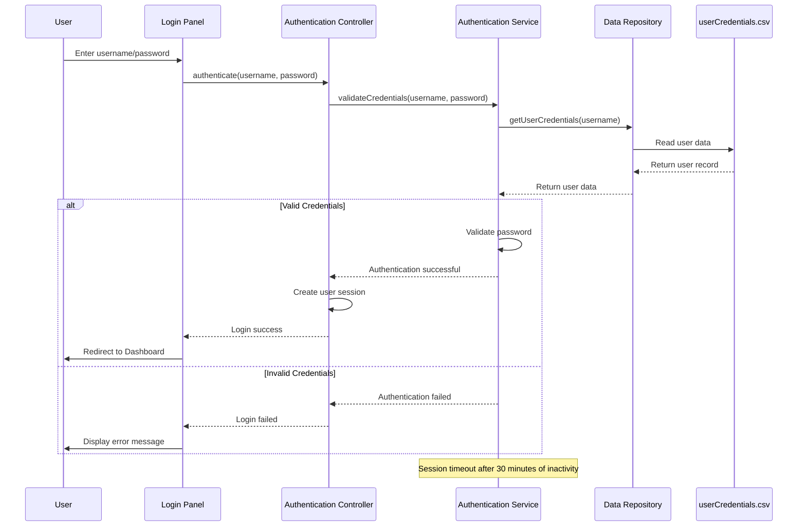

# Technical Requirements Document

MotorPH Payroll System
CP2_GROUP-4
July 3, 2025

---

## Revision History

| Date         | Version | Author      | Change                                  |
| :----------- | :------ | :---------- | :-------------------------------------- |
| July 3, 2025 | 1.0     | CP2_GROUP-4 | Initial technical requirements document |
|              |         |             |                                         |

## Table of Contents

1. **Overview**
   1.1  Purpose and Scope
   1.2  Referenced Documentation
   1.3  Requirement Assumptions and Support Considerations
2. **Specific Technical Requirements**
   2.1  Technical Requirements
   2.1.1 System Requirements
   2.1.2 Network Requirements
   2.1.3 Database Requirements
   2.1.4 User Interface Requirements
   2.1.5 System Interface Requirements
   2.1.6 Security Requirements
3. **APPENDIX**

---

## 1. Overview

The MotorPH Payroll System is a comprehensive Java-based desktop application designed to manage employee information, process payroll calculations, and generate reports for MotorPH company operations. This system implements a complete employee management solution with authentication, CRUD operations, and payroll processing capabilities using CSV file-based data persistence.

The system development follows a structured Software Development Life Cycle (SDLC) approach, implementing change requests MPHCR-01 through MPHCR-04 over an 11-week development period. The project serves both educational purposes for the MO-IT103 Computer Programming 2 course and demonstrates production-ready software development practices.

**Project Stakeholders:**

- **Project Sponsor**: MO-IT103 Course Instructor/Mentor
- **Primary Users**: HR Personnel, Payroll Administrators, System Administrators
- **Developer Group**: CP2_GROUP-4
- **Support Group**: Development Team and Course Support Staff
- **Operating Sites**: Desktop environments in educational and potential corporate settings

**High-Level Technical Summary:**
The solution implements a layered MVC (Model-View-Controller) architecture using Java 17 with Swing GUI framework, OpenCSV for data persistence, and Maven for dependency management. The system provides secure authentication, comprehensive employee management, automated payroll processing, and professional reporting capabilities.

### System Architecture Overview



### 1.1 Purpose and Scope

**Purpose:**
This Technical Requirements Document defines the complete technical specifications for the MotorPH Payroll System, providing sufficient detail for system design, development, testing, and maintenance activities. The document serves as the authoritative source for all technical decisions and implementation guidelines.

**Scope:**
This document covers all technical aspects of the MotorPH Payroll System including:

- **Hardware and software requirements** for development and deployment
- **System architecture** and component specifications
- **Data management** and file structure requirements
- **User interface** design and interaction specifications
- **Security protocols** and authentication mechanisms
- **Performance criteria** and operational constraints
- **Integration points** and external system interfaces

**Out of Scope:**

- Production deployment infrastructure beyond desktop environments
- Network-based multi-user concurrent access
- Database server implementation (system uses CSV file storage)
- Web-based or mobile interface implementations
- Advanced reporting with business intelligence features
- Real-time data synchronization with external HR systems

### 1.2 Referenced Documentation

| Document Number | Version | Document Name                        |
| :-------------- | :------ | :----------------------------------- |
| MPHCR-01        | 1.0     | GUI Implementation Change Request    |
| MPHCR-02        | 1.0     | File Handling and CRUD Operations    |
| MPHCR-03        | 1.0     | Update and Delete Functionality      |
| MPHCR-04        | 1.0     | Authentication System Implementation |
| QA-TEST-PLAN    | 1.0     | Quality Assurance Test Plan          |
| PROJECT-SUMMARY | 1.0     | MotorPH Project Summary Document     |
| README.md       | 1.0     | System Setup and Installation Guide  |

### 1.3 Requirement Assumptions and Support Considerations

**Technology Environment Assumptions:**

- Java Runtime Environment (JRE) 17 or higher available
- Display resolution minimum 1366x768 pixels
- File system access permissions for CSV file operations

**Behavioral Requirements:**

- **Response Time**: All user interactions must respond within 2 seconds under normal operating conditions
- **Data Integrity**: System must maintain consistency between in-memory objects and CSV file storage
- **Error Recovery**: Application must gracefully handle and recover from file I/O errors, invalid data, and user input errors
- **Session Management**: System must maintain user session state throughout application lifecycle

**Performance Constraints:**

- **Employee Data**: Support up to 10,000 employee records with acceptable performance
- **Memory Usage**: Application must operate within 512MB heap space
- **File Operations**: CSV read/write operations must complete within 5 seconds for datasets up to 10,000 records
- **UI Responsiveness**: All GUI operations must maintain 60fps rendering for smooth user experience

**Critical System Decisions:**

- **Security Model**: Role-based access control with local authentication
- **Data Persistence**: CSV file format for cross-platform compatibility and educational transparency
- **Architecture Pattern**: Layered MVC architecture for maintainability and testability
- **Error Handling**: Comprehensive exception handling with user-friendly error messages and detailed logging

**Input/Output Specifications:**

- **Accepted Inputs**: Employee personal data, attendance records, user credentials, payroll parameters
- **Generated Outputs**: Payslip documents, employee reports, system logs, CSV data exports
- **File Formats**: CSV for data storage, LOG for system logging, PDF capability for payslip generation

**Database File Structure:**

- **employeeDetails.csv**: Complete employee information including personal, employment, and compensation data
- **attendanceRecord.csv**: Time tracking and attendance data for payroll processing
- **userCredentials.csv**: Authentication credentials and user role information

### Data Flow Architecture



---

## 2. Specific Technical Requirements

This section contains all technical requirements in sufficient detail for system design development and comprehensive testing. Requirements are classified as either Mandatory (core functionality) or Desirable (enhancement features).

### 2.1 Technical Requirements

The MotorPH Payroll System must satisfy all mandatory requirements for core functionality while implementing desirable features based on available development resources and timeline constraints.

**Classification Definitions:**

- **Mandatory**: "Must Have" - Represents core functionality required for system operation
- **Desirable**: "Nice to Have" - Enhancement features implemented after core requirements are satisfied

### System Class Structure

```mermaid
classDiagram
    class Main {
        +main(String[] args)
    }

    class AuthenticationController {
        -AuthenticationService authService
        +login(String username, String password) : boolean
        +logout() : void
        +getCurrentUser() : User
    }

    class EmployeeController {
        -EmployeeService employeeService
        +createEmployee(Employee employee) : void
        +updateEmployee(Employee employee) : void
        +deleteEmployee(int employeeId) : void
        +getEmployee(int employeeId) : Employee
        +getAllEmployees() : List~Employee~
    }

    class PayrollController {
        -PayrollService payrollService
        +generatePayslip(int employeeId, Date payPeriod) : PaySlip
        +processPayroll(Date payPeriod) : void
        +calculateSalary(Employee employee, AttendanceRecord attendance) : double
    }

    class Employee {
        -int employeeId
        -String firstName
        -String lastName
        -String position
        -double basicSalary
        -Date hireDate
        +getFullName() : String
        +calculateMonthlySalary() : double
    }

    class AttendanceRecord {
        -int employeeId
        -Date workDate
        -Time timeIn
        -Time timeOut
        -double hoursWorked
        +calculateOvertime() : double
        +isPresent() : boolean
    }

    class PaySlip {
        -int payslipId
        -int employeeId
        -Date payPeriod
        -double basicPay
        -double overtime
        -double deductions
        -double netPay
        +calculateNetPay() : double
        +generatePDF() : void
    }

    class User {
        -String username
        -String password
        -String role
        -boolean isActive
        +authenticate(String password) : boolean
        +hasPermission(String permission) : boolean
    }

    class DataRepository {
        -String dataPath
        +readEmployees() : List~Employee~
        +writeEmployees(List~Employee~ employees) : void
        +readAttendance() : List~AttendanceRecord~
        +readUsers() : List~User~
        +backup() : void
    }

    class AuthenticationService {
        -DataRepository repository
        +validateCredentials(String username, String password) : User
        +createSession(User user) : void
        +isSessionValid() : boolean
    }

    class EmployeeService {
        -DataRepository repository
        +addEmployee(Employee employee) : void
        +updateEmployee(Employee employee) : void
        +removeEmployee(int employeeId) : void
        +searchEmployees(String criteria) : List~Employee~
    }

    class PayrollService {
        -DataRepository repository
        -EmployeeService employeeService
        +processMonthlyPayroll(Date month) : List~PaySlip~
        +calculatePay(Employee emp, AttendanceRecord att) : PaySlip
        +generateReports(Date period) : void
    }

    %% Relationships
    Main --> AuthenticationController
    AuthenticationController --> AuthenticationService
    EmployeeController --> EmployeeService
    PayrollController --> PayrollService
  
    AuthenticationService --> DataRepository
    EmployeeService --> DataRepository
    PayrollService --> DataRepository
    PayrollService --> EmployeeService
  
    DataRepository --> Employee
    DataRepository --> AttendanceRecord
    DataRepository --> User
    DataRepository --> PaySlip
  
    PayrollService --> PaySlip
    EmployeeService --> Employee
    AuthenticationService --> User
  
    Employee --> AttendanceRecord
    Employee --> PaySlip
  
    %% Styling
    classDef controller fill:#e1f5fe,stroke:#01579b,stroke-width:2px
    classDef service fill:#e8f5e8,stroke:#2e7d32,stroke-width:2px
    classDef model fill:#fff3e0,stroke:#ef6c00,stroke-width:2px
    classDef repository fill:#f3e5f5,stroke:#7b1fa2,stroke-width:2px
  
    class AuthenticationController,EmployeeController,PayrollController controller
    class AuthenticationService,EmployeeService,PayrollService service
    class Employee,AttendanceRecord,PaySlip,User model
    class DataRepository repository
```

#### 2.1.1 System Requirements

**Hardware Requirements - Minimum:**

**Software Requirements - Mandatory:**

- **Operating System**: Windows 10 (build 1903 or later), Windows 11
- **Java Runtime**: OpenJDK 17 or Oracle JDK 17 (LTS version required)
- **File System**: NTFS with read/write permissions for application directory

**Software Requirements - Desirable:**

- **Text Editor**: Advanced text editor for CSV file inspection and manual editing

**Development Environment Requirements:**

- **IDE**: IntelliJ IDEA 2023.x or Eclipse 2023-03 or later
- **Build Tool**: Apache Maven 3.9.x or later
- **Version Control**: Git 2.40.x or later

### System Deployment Architecture



#### 2.1.2 Network Requirements

**Mandatory Network Requirements:**

**Desirable Network Requirements:**

**Security Network Considerations:**

#### 2.1.3 Database Requirements

**File-Based Data Storage - Mandatory:**

- **Primary Storage**: CSV (Comma-Separated Values) format for all data persistence
- **File Location**: Relative 'data/' directory within application installation folder
- **Character Encoding**: UTF-8 encoding for international character support
- **File Locking**: Exclusive file access during read/write operations to prevent data corruption

**Data Files Structure:**

```
data/
├── employeeDetails.csv      # Employee master data
├── attendanceRecord.csv     # Attendance and time tracking
└── userCredentials.csv      # Authentication credentials
```

**Data Integrity Requirements:**

- **Backup Strategy**: Automatic backup creation before any data modification operations
- **Rollback Capability**: Transaction-like behavior with rollback on operation failure
- **Data Validation**: Comprehensive input validation before data persistence
- **Error Recovery**: Automatic recovery from corrupted CSV files using backup data

**Performance Requirements:**

- **Read Operations**: Support up to 10,000 records with sub-2-second load times
- **Write Operations**: Atomic write operations with temporary file staging
- **Memory Management**: Efficient data loading with pagination for large datasets
- **Concurrent Access**: File locking mechanisms to prevent simultaneous write operations

**Desirable Database Features:**

- **Data Export**: Export capabilities to Excel format (.xlsx)
- **Data Import**: Bulk import from external CSV sources with validation
- **Archive Management**: Automatic archiving of historical payroll data
- **Data Compression**: Compression for historical data files

### Payroll Processing Workflow



#### 2.1.4 User Interface Requirements

**GUI Framework - Mandatory:**

- **Technology**: Java Swing with modern Look-and-Feel implementation
- **Design Pattern**: Model-View-Controller (MVC) architecture for UI components
- **Styling**: Consistent color scheme using Bootstrap-inspired design tokens
- **Responsive Design**: Adaptive layouts supporting multiple screen resolutions

**Visual Design Standards:**

- **Color Palette**: Professional blue (#007BFF) primary, with semantic colors for success, warning, and error states
- **Typography**: Segoe UI font family with hierarchical font sizes (12px-24px)
- **Spacing**: Consistent 10px/20px padding and margin throughout interface
- **Icons**: Professional iconography for actions and navigation elements

**User Experience Requirements - Mandatory:**

**Interface Components:**

- **Authentication Screen**: Secure login with username/password fields
- **Dashboard**: System overview with key metrics and quick action buttons
- **Employee Management**: CRUD operations with data grid and form interfaces
- **Payroll Processing**: Payslip generation and payroll calculation interfaces
- **Reporting**: Report generation and viewing capabilities

**Desirable UI Features:**

- **Dark Mode**: Alternative dark theme for reduced eye strain
- **Customizable Layouts**: User preference settings for interface customization
- **Advanced Search**: Complex filtering and search capabilities
- **Data Visualization**: Charts and graphs for payroll analytics
- **Print Preview**: WYSIWYG print preview for reports and payslips

### User Interface Navigation Flow



#### 2.1.5 System Interface Requirements

**Internal Component Interfaces - Mandatory:**

- **Controller Layer**: RESTful-style interfaces between UI and business logic
- **Service Layer**: Well-defined service interfaces for business operations
- **Repository Layer**: Data access abstraction for CSV file operations
- **Model Layer**: Consistent data model interfaces across all components

**File System Interfaces:**

- **CSV Reading**: Robust CSV parsing with error handling and data validation
- **CSV Writing**: Atomic write operations with backup and rollback capabilities
- **File Monitoring**: Detection of external file modifications with user notification
- **Path Management**: Relative and absolute path resolution for cross-platform compatibility

**Logging Interface - Mandatory:**

- **Log Framework**: Java Util Logging (JUL) for comprehensive system logging
- **Log Levels**: DEBUG, INFO, WARN, ERROR, FATAL with configurable output
- **Log Rotation**: Automatic log file rotation with size and time-based policies
- **Log Format**: Structured logging with timestamp, level, class, and message

**Desirable External Interfaces:**

- **Email Integration**: SMTP interface for automated payslip distribution
- **PDF Generation**: PDF library integration for professional report output
- **Excel Export**: Apache POI integration for Excel file generation
- **Print Services**: System print interface for report and payslip printing

#### 2.1.6 Security Requirements

**Authentication System - Mandatory:**

- **User Authentication**: Username and password-based authentication with role validation
- **Session Management**: Secure session handling with automatic timeout
- **Password Policy**: Minimum password complexity requirements
- **Account Lockout**: Protection against brute force attacks with account lockout

### User Authentication Flow



**Authorization and Access Control:**

- **Role-Based Access**: Admin and User roles with different permission levels
- **Data Access Control**: Restricted access to sensitive employee and payroll data
- **Function Authorization**: Role-based access to system functions and features
- **Audit Trail**: Logging of all user actions and data modifications

**Data Security - Mandatory:**

- **Input Validation**: Comprehensive validation to prevent injection attacks
- **Data Sanitization**: Proper sanitization of all user inputs before processing
- **File Security**: Secure file handling to prevent unauthorized access
- **Error Information**: Controlled error messages that don't expose system internals

**Desirable Security Features:**

- **Password Encryption**: Hashed password storage using bcrypt or similar
- **Data Encryption**: Encryption of sensitive data in CSV files
- **Backup Security**: Encrypted backup files with secure key management
- **Security Logging**: Detailed security event logging for audit purposes

**Security Compliance:**

---

## 3. APPENDIX

### Diagram Index

This document includes the following Mermaid diagrams to enhance understanding of the MotorPH Payroll System:

| Diagram Type                   | Section                        | Purpose                                                                                               |
| :----------------------------- | :----------------------------- | :---------------------------------------------------------------------------------------------------- |
| **Architecture Diagram** | System Architecture Overview   | Shows the layered MVC architecture with presentation, business logic, data access, and storage layers |
| **Sequence Diagram**     | User Authentication Flow       | Illustrates the step-by-step authentication process from user login to session creation               |
| **Flowchart**            | Data Flow Architecture         | Displays the flow of data through UI components, controllers, services, and CSV storage               |
| **Class Diagram**        | System Class Structure         | Presents the main system classes, their attributes, methods, and relationships                        |
| **Flowchart**            | Payroll Processing Workflow    | Details the complete payroll processing workflow including error handling and backup procedures       |
| **Flowchart**            | User Interface Navigation Flow | Maps the navigation paths between different screens for admin and user roles                          |
| **Flowchart**            | System Deployment Architecture | Shows the physical deployment architecture including hardware, software, and file system components   |

These diagrams provide visual representations of:

- **System Architecture**: How components interact in the layered architecture
- **User Workflows**: Authentication and navigation flows
- **Data Processing**: Payroll calculation and data management processes
- **Physical Deployment**: Hardware and software requirements
- **Code Structure**: Object-oriented design and relationships

### Detailed Technical Requirements Matrix

| Reference # | Technical Requirement         | Classification | Description                                                         | Comments                         |
| :---------- | :---------------------------- | :------------- | :------------------------------------------------------------------ | :------------------------------- |
| TR-001      | Java 17 Runtime Environment   | Mandatory      | Application requires Java 17 LTS for core functionality             | OpenJDK or Oracle JDK acceptable |
| TR-002      | CSV File Data Persistence     | Mandatory      | All data stored in CSV format for transparency and portability      | UTF-8 encoding required          |
| TR-003      | Swing GUI Framework           | Mandatory      | Desktop GUI implementation using Java Swing                         | Modern Look-and-Feel applied     |
| TR-004      | Authentication System         | Mandatory      | Username/password authentication with role-based access             | Session management included      |
| TR-005      | Employee CRUD Operations      | Mandatory      | Complete Create, Read, Update, Delete operations for employee data  | Data validation required         |
| TR-006      | Payroll Processing Engine     | Mandatory      | Automated payroll calculations based on attendance data             | Support for various pay types    |
| TR-007      | Error Handling Framework      | Mandatory      | Comprehensive error handling with user-friendly messages            | Logging integration required     |
| TR-008      | Data Backup and Recovery      | Mandatory      | Automatic backup before data modifications with rollback capability | Transaction-like behavior        |
| TR-009      | Responsive UI Design          | Mandatory      | Adaptive interface supporting multiple screen resolutions           | Minimum 1366x768 support         |
| TR-010      | System Logging                | Mandatory      | Comprehensive logging for debugging and audit purposes              | Configurable log levels          |
| TR-011      | PDF Report Generation         | Desirable      | PDF output for payslips and reports                                 | Third-party library integration  |
| TR-012      | Excel Export Functionality    | Desirable      | Export data to Excel format for external analysis                   | Apache POI integration           |
| TR-013      | Advanced Search and Filtering | Desirable      | Complex search capabilities across employee data                    | Performance optimized            |
| TR-014      | Data Encryption               | Desirable      | Encryption of sensitive data files                                  | Key management required          |
| TR-015      | Email Integration             | Desirable      | Automated email distribution of payslips                            | SMTP configuration               |
| TR-016      | Dark Mode UI Theme            | Desirable      | Alternative dark theme for user preference                          | Consistent styling               |
| TR-017      | Audit Trail System            | Desirable      | Detailed audit trail of all system operations                       | Compliance support               |
| TR-018      | Multi-language Support        | Desirable      | Internationalization for multiple languages                         | Resource bundle implementation   |
| TR-019      | Performance Monitoring        | Desirable      | System performance metrics and monitoring                           | Memory and CPU tracking          |
| TR-020      | Automated Testing Suite       | Desirable      | Comprehensive unit and integration test coverage                    | JUnit framework                  |

### Performance Specifications

| Metric                     | Requirement                     | Measurement Method                 |
| :------------------------- | :------------------------------ | :--------------------------------- |
| Application Startup Time   | < 5 seconds                     | Time from launch to main interface |
| Data Loading Performance   | < 2 seconds for 1000 records    | CSV file read operations           |
| User Interface Response    | < 500ms for standard operations | UI action to visual feedback       |
| Memory Usage               | < 512MB heap space              | JVM memory monitoring              |
| File Operation Performance | < 5 seconds for 10,000 records  | CSV write operations               |
| Search Response Time       | < 1 second                      | Employee search operations         |

### Compliance and Standards

|  |
| :- |

---

*Confidential - ©2025 CP2_GROUP-4*
