# 🏗️ MotorPH System Architecture Diagrams

## Complete System Architecture

## MPHCR-02 Feature Integration

```mermaid
flowchart TD
    subgraph "MPHCR-02 New Components"
        A[EmployeeListPanel<br/>📊 Employee Table Display]
        B[NewEmployeeDialog<br/>➕ Employee Creation]
        C[ActionButtonRenderer<br/>🎨 Custom Table UI]
        D[ActionButtonEditor<br/>⚡ Button Interactions]
        E[CSV Enhancement<br/>💾 File Persistence]
    end
    
    subgraph "Enhanced Existing Components"
        F[EmployeeService<br/>🔧 CRUD Operations]
        G[EmployeeController<br/>🎮 Enhanced Logic]
        H[UIConstants<br/>🎨 Style System]
        I[Employee Model<br/>📋 Extended Fields]
    end
    
    subgraph "Data Flow"
        J[User Input] --> B
        B --> G
        G --> F
        F --> E
        E --> K[CSV Files]
        
        L[User Views List] --> A
        A --> C
        C --> D
        D --> M[Employee Actions]
    end
    
    A --> F
    B --> F
    C --> H
    D --> H
    F --> I
    
    style A fill:#4caf50,color:#fff
    style B fill:#2196f3,color:#fff
    style E fill:#ff9800,color:#fff
    style H fill:#9c27b0,color:#fff
```

## User Interaction Flow

## Component Dependency Graph

## Data Model Relationships

## File Structure and Organization

## Technology Stack Overview

---

*These diagrams represent the complete architecture of the MPHCR-02 enhanced MotorPH Payroll System, highlighting the new components and their integration with existing system elements.*
