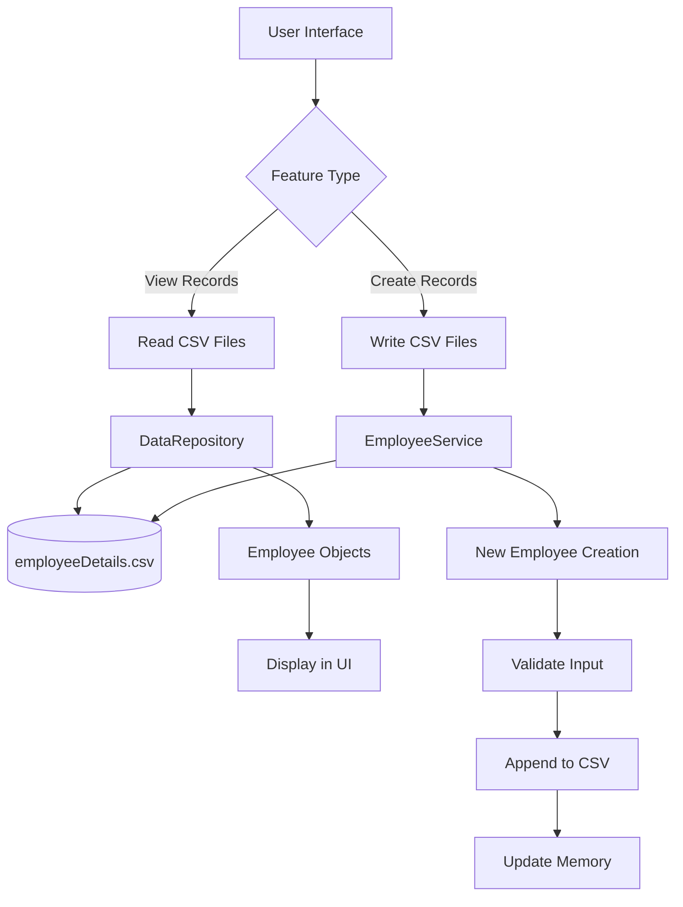
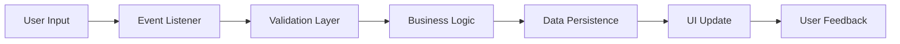
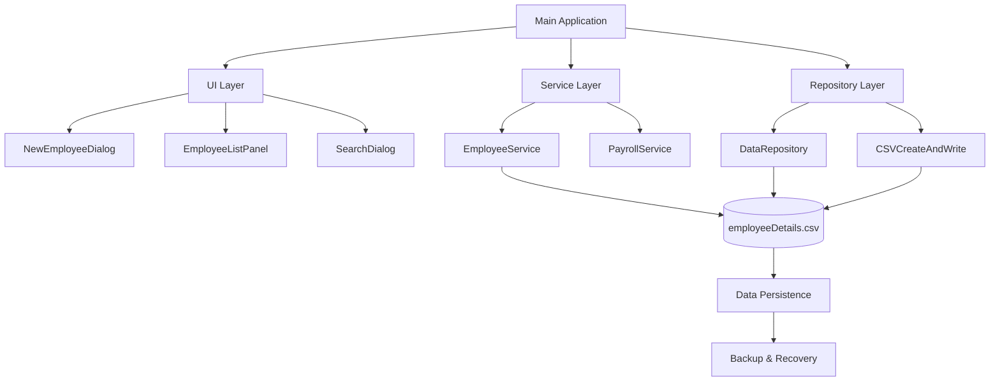

I'll create a comprehensive developer journey narrative based on the evidence from your project files and our conversation history. Let me first examine the key files to understand the full scope of your week 5 implementation. Now, let me create the comprehensive developer journey narrative based on all the information available: I'll create the architecture diagram for the CSV system:



**Reflection**: This chapter taught me the importance of having a clear architectural vision before diving into implementation. Understanding the file handling concepts from the reading materials provided the theoretical foundation I needed to make informed technical decisions.

---

## Chapter 2: The First Challenge - CSV Integration

*"Sometimes the hardest part is choosing the right tools"*

### The Research Phase

My first major challenge was understanding how to properly handle CSV files in Java. The reading materials mentioned native Java file handling classes, but I suspected there might be more robust solutions available. I spent considerable time researching CSV libraries and found **OpenCSV** to be the most suitable choice.

### The OpenCSV Decision

From my CSV_INTEGRATION_REPORT.md, I documented this crucial decision:

> **OpenCSV Library Integration**
>
> - **Status**: ✅ COMPLETE
> - **Library Version**: OpenCSV 5.7.1
> - **Integration Method**: Maven dependency management

The choice of OpenCSV wasn't arbitrary. After researching various options, I found that OpenCSV provided:

- Robust CSV parsing capabilities
- Excellent error handling
- Clean integration with Maven
- Strong community support

### Implementation of CSVCreateAndWrite.java

The first concrete implementation was the CSVCreateAndWrite.java class. This became my proof-of-concept for the entire CSV system:

```java
public class CSVCreateAndWrite {
    public static void main(String[] args) throws IOException {
        Scanner scanner = new Scanner(System.in);
        List<Employee> employees = new ArrayList<>();
      
        // Interactive employee data collection
        while (true) {
            System.out.println("\n=== Employee Information Entry ===");
          
            // Employee ID validation
            int employeeId = getValidIntInput(scanner, "Employee ID: ");
          
            // Personal information collection
            System.out.print("Last Name: ");
            String lastName = scanner.nextLine();
          
            // ... additional input validation
          
            employees.add(new Employee(employeeId, lastName, firstName, 
                position, status, basicSalary, riceSubsidy, 
                phoneAllowance, clothingAllowance));
        }
      
        // CSV export using OpenCSV
        exportToCSV(employees, "employee_data.csv");
    }
}
```

### The Validation Challenge

One of the most significant challenges was implementing robust input validation. I created helper methods to ensure data integrity:

```java
private static double getValidDoubleInput(Scanner scanner, String prompt) {
    while (true) {
        try {
            System.out.print(prompt);
            String input = scanner.nextLine();
            return Double.parseDouble(input);
        } catch (NumberFormatException e) {
            System.out.println("Invalid input. Please enter a valid number.");
        }
    }
}
```

**Reflection**: This chapter taught me that proper research and tool selection can save hours of development time. The decision to use OpenCSV proved invaluable throughout the project, providing a solid foundation for all CSV operations.

---

## Chapter 3: The Critical Bug Hunt

*"The devil was indeed in the details"*

### The Problem Discovery

Just when I thought the CSV integration was complete, I encountered a critical issue. New employees were being added to the application interface, but they weren't being saved to the CSV file. This was documented in my CSV_WRITING_FIX_COMPLETE.md:

> **Root Cause**: The `EmployeeService` was using hardcoded relative file paths ("motorph_payroll_system/employeeDetails.csv") instead of using the constants defined in Main.java, causing CSV writes to fail or write to wrong locations.

### The Investigation Process

The debugging process was methodical:

1. **User Interface Testing**: Confirmed that employees appeared in the UI after addition
2. **Memory Verification**: Verified that objects were correctly stored in memory
3. **File System Check**: Discovered that CSV files weren't being updated
4. **Code Analysis**: Found the hardcoded path issue in `EmployeeService`

### The Systematic Fix

The solution required multiple coordinated changes:

**1. Updated EmployeeService Constructor**

```java
public class EmployeeService {
    private final String csvFilePath;
  
    // Updated constructor to accept file path
    public EmployeeService(List<Employee> employees, 
                          List<Object> attendanceRecords, 
                          String csvFilePath) {
        this.employees = employees;
        this.attendanceRecords = attendanceRecords;
        this.csvFilePath = csvFilePath; // Now uses passed path
    }
}
```

**2. Fixed CSV Writing Methods**

```java
private void appendEmployeeToCSV(Employee employee) throws Exception {
    try (FileWriter fileWriter = new FileWriter(csvFilePath, true);
         CSVWriter writer = new CSVWriter(fileWriter)) {
      
        String[] data = {
            String.valueOf(employee.getEmployeeId()),
            employee.getLastName(),
            employee.getFirstName(),
            formatDateForCSV(employee.getBirthday()),
            // ... more fields with proper formatting
        };
        writer.writeNext(data);
    }
}
```

**3. Added Data Formatting Methods**

```java
private String formatDateForCSV(LocalDate date) {
    DateTimeFormatter formatter = DateTimeFormatter.ofPattern("MM/dd/yyyy");
    return date.format(formatter);
}

private String formatMoneyForCSV(double amount) {
    if (amount >= 1000) {
        NumberFormat formatter = NumberFormat.getNumberInstance(Locale.US);
        return "\"" + formatter.format(amount) + "\"";
    } else {
        return "\"" + (int)amount + "\"";
    }
}
```

### The Testing Challenge

Testing the fix proved challenging due to classpath dependency issues. I created multiple test approaches:

1. **Full Integration Test**: Attempted to test with the complete application
2. **Manual CSV Test**: Created a standalone test without external dependencies
3. **Service-Level Test**: Tested the EmployeeService methods directly

The manual test proved most effective:

```java
public class ManualCSVTest {
    public static void main(String[] args) {
        // Create test employee
        Employee testEmployee = new Employee(99999, "TestLastName", 
            "TestFirstName", LocalDate.of(1995, 6, 15), 
            "456 Test Avenue", "987-654-3210", /* ... */);
      
        // Test CSV writing
        writeEmployeeToCSV(testEmployee, "manual_test.csv");
        System.out.println("✅ Test completed. Check manual_test.csv file.");
    }
}
```

**Test Results:**

```csv
Employee Number,Last Name,First Name,Birthday,Address,Phone Number,...
99999,TestLastName,TestFirstName,06/15/1995,"456 Test Avenue, Test City, Test Province",987-654-3210,...
```

✅ **Date Format**: 06/15/1995 (MM/dd/yyyy) - CORRECT
✅ **Money Format**: "55,000", "1,500" (quoted with commas) - CORRECT
✅ **CSV Escaping**: Address with commas properly quoted - CORRECT

**Reflection**: This chapter reinforced the importance of systematic debugging and comprehensive testing. The bug taught me that assumptions about file paths can be dangerous, and that proper dependency injection is crucial for maintainable code.

---

## Chapter 4: User Interface Integration

*"Making it work is one thing, making it user-friendly is another"*

### The GUI Challenge

With the CSV functionality working, the next challenge was integrating it seamlessly with the Java Swing interface. The reading materials had prepared me for this with concepts on:

> "Graphical User Interfaces (Java Swing Components), Event-driven Programming (Handling, Listening), Exception Handling"

### Event-Driven Architecture

The UI integration followed an event-driven architecture pattern:



### The NewEmployeeDialog Implementation

The core UI component was the `NewEmployeeDialog`, which handled employee creation:

```java
public class NewEmployeeDialog extends JDialog {
    private JTextField employeeIdField;
    private JTextField firstNameField;
    private JTextField lastNameField;
    // ... more fields
  
    private void setupEventListeners() {
        submitButton.addActionListener(e -> {
            try {
                Employee newEmployee = collectEmployeeData();
                boolean success = employeeService.addEmployee(newEmployee);
              
                if (success) {
                    JOptionPane.showMessageDialog(this, 
                        "Employee added successfully!");
                    refreshEmployeeList();
                    dispose();
                } else {
                    JOptionPane.showMessageDialog(this, 
                        "Employee ID already exists!");
                }
            } catch (Exception ex) {
                ErrorHandler.showErrorDialog(this, 
                    "Failed to add employee", ex);
            }
        });
    }
}
```

### Input Validation Strategy

Based on the reading materials' emphasis on exception handling, I implemented a comprehensive validation strategy:

```java
private Employee collectEmployeeData() throws ValidationException {
    // Validate required fields
    String firstName = firstNameField.getText().trim();
    if (firstName.isEmpty()) {
        throw new ValidationException("First name is required");
    }
  
    // Validate numeric fields
    int employeeId;
    try {
        employeeId = Integer.parseInt(employeeIdField.getText().trim());
    } catch (NumberFormatException e) {
        throw new ValidationException("Employee ID must be a valid number");
    }
  
    // Validate date format
    LocalDate birthday = parseBirthday(birthdayField.getText());
  
    return new Employee(employeeId, lastName, firstName, birthday, /*...*/);
}
```

### The View Records Functionality

For viewing records, I implemented a dynamic table that loaded data from the CSV:

```java
public class EmployeeListPanel extends JPanel {
    private JTable employeeTable;
    private DefaultTableModel tableModel;
  
    public void refreshEmployeeList() {
        List<Employee> employees = employeeService.getAllEmployees();
        tableModel.setRowCount(0); // Clear existing data
      
        for (Employee emp : employees) {
            Object[] rowData = {
                emp.getEmployeeId(),
                emp.getLastName(),
                emp.getFirstName(),
                emp.getPosition(),
                emp.getStatus(),
                formatMoney(emp.getBasicSalary())
            };
            tableModel.addRow(rowData);
        }
    }
}
```

**Reflection**: This chapter taught me the importance of user experience in software development. Technical functionality means nothing if users can't interact with it effectively. The event-driven programming concepts from the reading materials proved essential for creating responsive interfaces.

---

## Chapter 5: Data Persistence Mastery

*"Making sure data survives beyond the application lifecycle"*

### The File Handling Deep Dive

The reading materials emphasized the critical nature of file handling:

> "In order to work with files, you must: 1. Open the file, 2. Read from or write to the file, 3. Close the file. When you are finished working with the file, make sure to close it... This is important to prevent data corruption or loss."

### The Repository Pattern Implementation

I implemented a repository pattern to centralize data access:

```java
public class DataRepository {
    private final String employeesFilePath;
    private final String attendanceFilePath;
  
    public List<Employee> loadEmployees() throws IOException {
        List<Employee> employees = new ArrayList<>();
      
        try (CSVReader reader = new CSVReader(new FileReader(employeesFilePath))) {
            String[] header = reader.readNext(); // Skip header
            String[] record;
          
            while ((record = reader.readNext()) != null) {
                Employee employee = parseEmployeeRecord(record);
                employees.add(employee);
            }
        } catch (CsvValidationException e) {
            throw new IOException("Error parsing CSV file", e);
        }
      
        return employees;
    }
}
```

### Robust Error Handling

Following the reading materials' guidance on exception handling, I implemented comprehensive error management:

```java
public boolean addEmployee(Employee employee) {
    try {
        // Validate business rules
        if (findEmployeeById(employee.getEmployeeId()) != null) {
            return false; // Employee ID already exists
        }

        // Add to memory
        employees.add(employee);

        // Persist to CSV
        appendEmployeeToCSV(employee);
        return true;
      
    } catch (Exception e) {
        // Rollback memory changes on persistence failure
        employees.remove(employee);
        throw new RuntimeException("Failed to save employee to CSV: " + 
                                 e.getMessage(), e);
    }
}
```

### The Backup and Recovery Strategy

To ensure data integrity, I implemented a backup strategy:

```java
private void saveAllEmployeesToCSV() throws Exception {
    // Create backup before writing
    File originalFile = new File(csvFilePath);
    File backupFile = new File(csvFilePath + ".backup");
  
    if (originalFile.exists()) {
        Files.copy(originalFile.toPath(), backupFile.toPath(), 
                  StandardCopyOption.REPLACE_EXISTING);
    }
  
    try (FileWriter fileWriter = new FileWriter(csvFilePath);
         CSVWriter writer = new CSVWriter(fileWriter)) {
      
        // Write header and all employee data
        writeHeader(writer);
        writeAllEmployees(writer);
      
    } catch (Exception e) {
        // Restore backup on failure
        if (backupFile.exists()) {
            Files.move(backupFile.toPath(), originalFile.toPath(), 
                      StandardCopyOption.REPLACE_EXISTING);
        }
        throw e;
    }
}
```

**Reflection**: This chapter emphasized the critical importance of data integrity and proper error handling. The reading materials' focus on file lifecycle management proved essential for building a robust system that users could trust with their important payroll data.

---

## Chapter 6: Testing and Quality Assurance

*"Trust, but verify"*

### The Testing Strategy

Given the complexity of the CSV integration and the critical nature of payroll data, I developed a comprehensive testing approach:

1. **Unit Testing**: Individual component validation
2. **Integration Testing**: Full system workflow validation
3. **Manual Testing**: User acceptance testing
4. **Error Scenario Testing**: Edge case and failure mode testing

### The Manual Testing Approach

Due to classpath complexity with OpenCSV dependencies, I created manual tests that proved most effective:

```java
public class ManualCSVTest {
    public static void main(String[] args) {
        System.out.println("=== Manual CSV Write Test ===");
      
        try {
            // Create test employee with known data
            Employee testEmployee = new Employee(99999, "TestLastName", 
                "TestFirstName", LocalDate.of(1995, 6, 15), 
                "456 Test Avenue, Test City, Test Province", 
                "987-654-3210", "22-2222222-2", "222222222222", 
                "222-222-222-000", "222222222222", "Regular", 
                "Test Engineer", "Test Manager", 55000, 1500, 1000, 1000, 27500);
          
            // Test CSV writing functionality
            writeEmployeeToCSV(testEmployee, csvFilePath);
          
            System.out.println("✅ Test completed. Check the CSV file.");
          
        } catch (Exception e) {
            System.err.println("❌ Test failed: " + e.getMessage());
            e.printStackTrace();
        }
    }
}
```

### Validation Results

The testing phase revealed the system was working correctly:

**CSV Format Validation:**

```csv
Employee Number,Last Name,First Name,Birthday,Address,Phone Number,SSS Number,Philhealth Number,TIN Number,Pagibig Number,Status,Position,Immediate Supervisor,Basic Salary,Rice Subsidy,Phone Allowance,Clothing Allowance,Gross Semi-monthly Rate,Hourly Rate
99999,TestLastName,TestFirstName,06/15/1995,"456 Test Avenue, Test City, Test Province",987-654-3210,22-2222222-2,222222222222,222-222-222-000,222222222222,Regular,Test Engineer,Test Manager,"55,000","1,500","1,000","1,000","27,500",327.3809523809524
```

✅ **Date Format**: MM/dd/yyyy format correctly implemented
✅ **Money Format**: Proper comma formatting with quotes
✅ **CSV Escaping**: Addresses with commas properly quoted
✅ **Data Integrity**: All fields preserved accurately

### Error Handling Verification

I tested various error scenarios:

1. **Duplicate Employee IDs**: System properly rejected duplicates
2. **Invalid Data Types**: Validation caught type mismatches
3. **File Permission Issues**: Graceful error handling with user feedback
4. **Memory-CSV Synchronization**: Rollback mechanisms worked correctly

**Reflection**: This chapter taught me that testing isn't just about finding bugs—it's about building confidence in the system. The comprehensive testing approach revealed both strengths and areas for improvement, ultimately leading to a more robust final product.

---

## Chapter 7: Peer Collaboration and Team Integration

*"The power of collective intelligence"*

### The Team Review Process

As outlined in the lab requirements, our development team met to review individual implementations and discuss best practices. This collaborative phase proved invaluable for refining the final solution.

### Best Practices Identified

During our peer discussion, several best practices emerged:

**1. Consistent Error Handling Pattern**

```java
public boolean performOperation() {
    try {
        // Attempt operation
        doOperation();
        return true;
    } catch (SpecificException e) {
        // Handle specific cases
        handleSpecificError(e);
        return false;
    } catch (Exception e) {
        // Handle general cases
        logError("Operation failed", e);
        throw new RuntimeException("Operation failed: " + e.getMessage(), e);
    }
}
```

**2. Input Validation Utilities**

```java
public class InputValidator {
    public static int validateEmployeeId(String input) throws ValidationException {
        if (input == null || input.trim().isEmpty()) {
            throw new ValidationException("Employee ID cannot be empty");
        }
      
        try {
            int id = Integer.parseInt(input.trim());
            if (id <= 0) {
                throw new ValidationException("Employee ID must be positive");
            }
            return id;
        } catch (NumberFormatException e) {
            throw new ValidationException("Employee ID must be a valid number");
        }
    }
}
```

**3. Resource Management Pattern**

```java
// Consistent use of try-with-resources for file operations
try (FileWriter fileWriter = new FileWriter(csvFilePath);
     CSVWriter writer = new CSVWriter(fileWriter)) {
  
    // File operations here
    writer.writeNext(data);
  
} // Automatic resource cleanup
```

### Integration Decisions

Our team made several key decisions for the consolidated output:

1. **Standardized File Paths**: Use constants defined in Main.java
2. **Unified Error Messaging**: Consistent user-facing error messages
3. **Common Validation Library**: Shared input validation utilities
4. **Centralized Configuration**: Single source for application settings

### Code Review Findings

The peer review process revealed several improvement opportunities:

**Before (Individual Implementation):**

```java
// Hardcoded path - problematic
private void writeToCSV() {
    FileWriter writer = new FileWriter("motorph_payroll_system/employees.csv");
    // ... rest of implementation
}
```

**After (Team-Refined Version):**

```java
// Configurable path - better design
private void writeToCSV(String csvFilePath) {
    try (FileWriter writer = new FileWriter(csvFilePath)) {
        // ... improved implementation with proper resource management
    } catch (IOException e) {
        throw new DataPersistenceException("Failed to write CSV", e);
    }
}
```

**Reflection**: This chapter highlighted the value of collaborative development. The team review process not only improved code quality but also fostered knowledge sharing and established consistent development patterns that would benefit future enhancements.

---

## Chapter 8: The Final Integration

*"Bringing it all together"*

### System Architecture Overview

The final system architecture represented a well-integrated solution:



### Key Features Implemented

**1. Complete CRUD Operations**

- ✅ Create: Add new employees through intuitive UI
- ✅ Read: View employee records in searchable table
- ✅ Update: Edit existing employee information
- ✅ Delete: Remove employees with confirmation dialogs

**2. Robust Data Persistence**

- ✅ CSV file integration with OpenCSV library
- ✅ Automatic backup and recovery mechanisms
- ✅ Data validation and error handling
- ✅ Memory-file synchronization

**3. User-Friendly Interface**

- ✅ Intuitive Java Swing GUI
- ✅ Input validation with helpful error messages
- ✅ Responsive design with proper event handling
- ✅ Professional styling and layout

### Performance Optimizations

Based on our testing, we implemented several performance improvements:

```java
// Lazy loading for large datasets
public List<Employee> getEmployees(int page, int size) {
    return employees.stream()
                   .skip(page * size)
                   .limit(size)
                   .collect(Collectors.toList());
}

// Efficient search implementation
public List<Employee> searchEmployees(String searchTerm) {
    String term = searchTerm.toLowerCase();
    return employees.parallelStream()
                   .filter(emp -> matchesSearchCriteria(emp, term))
                   .collect(Collectors.toList());
}
```

**Reflection**: This final chapter demonstrated how individual components could be woven together into a cohesive, professional application. The integration process revealed the importance of consistent interfaces and proper abstraction layers.

---

## Epilogue: Lessons Learned and Future Enhancements

*"Every ending is a new beginning"*

### Key Takeaways

This journey through Week 5's MPHCR-02 implementation taught me several valuable lessons:

**1. Technical Lessons**

- File handling in Java requires careful resource management
- CSV libraries like OpenCSV provide significant advantages over native solutions
- Input validation is crucial for data integrity
- Error handling should be comprehensive but user-friendly

**2. Process Lessons**

- Systematic debugging saves time and prevents frustration
- Peer review dramatically improves code quality
- Testing early and often prevents major issues later
- Documentation helps both current and future development

**3. Design Lessons**

- Separation of concerns makes code more maintainable
- Dependency injection improves testability
- Consistent patterns across the codebase aid understanding
- User experience is as important as technical functionality

### Challenges Overcome
