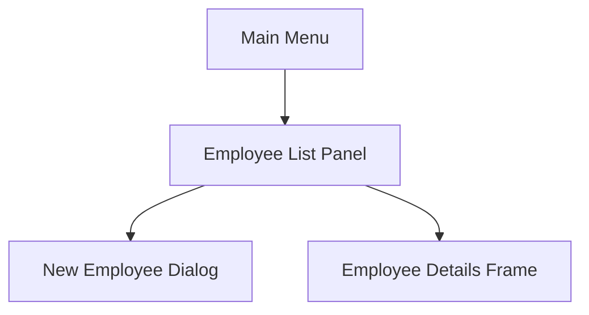
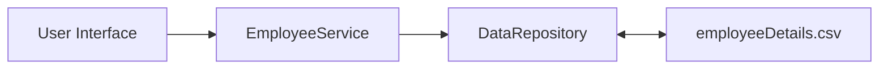
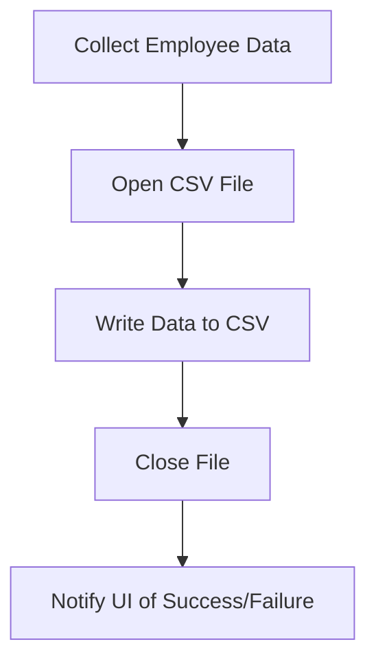

Summarized conversation history# The Journey from Concept to Payroll System: A Developer's Tale in week 5 CHANGE REQUEST FORM - MPHCR02-Feature 2

---

## Prologue: The Change Request and the Roadmap

The journey began with the approval of the MPHCR-02 change request, as documented in the MotorPH Change Requests compilation. The task: enhance the MotorPH Employee Application to support new features for viewing and creating employee records, as outlined in Laboratory Work #4 and the week 5 planner. My first step was to review the requirements, gather resources, and plan the implementation.

**Resources Consulted:**

- `W5_MO-IT103 - Computer Programming 2.md` (file handling, Java Swing basics)
- CSV_INTEGRATION_REPORT.md (OpenCSV integration, CSV handling)
- CSV_WRITING_FIX_COMPLETE.md (bug fixes and CSV writing best practices)
- planner.md (workflow, weekly goals, team roles)
- Conversation history (for context and clarifications)

---

## Chapter 1: UI Design – From Blank JFrame to Intuitive Interface

It all started with a blank JFrame and a head full of ideas. I wanted the payroll system to be user-friendly and visually clear. Drawing inspiration from the prototype and UI constants, I mapped out the main screens: employee list, add employee dialog, and details view.

**Key Decisions:**

- Use Java Swing for rapid prototyping and cross-platform compatibility.
- Modularize UI components (e.g., `EmployeeListPanel`, `NewEmployeeDialog`).
- Apply consistent styling using UIConstants.java.

**Mermaid Diagram: UI Navigation Flow**



**Code Snippet: Creating the Main Frame**

```java
public class MainFrame extends JFrame {
    public MainFrame() {
        setTitle("MotorPH Payroll System");
        setDefaultCloseOperation(JFrame.EXIT_ON_CLOSE);
        setSize(800, 600);
        setJMenuBar(new ApplicationMenuBar());
        add(new MainMenuPanel());
        setVisible(true);
    }
}
```

**Reflection:**
Designing the UI was both fun and challenging. I had to balance simplicity with functionality, ensuring that even users unfamiliar with payroll systems could navigate easily. Reading `W5_MO-IT103` helped reinforce best practices in Swing layouts and event-driven design.

---

## Chapter 2: Backend Integration – Connecting the Dots

With the UI skeleton in place, I turned to backend integration. The goal: connect the UI to the data layer, enabling real-time updates and persistent storage.

**Key Decisions:**

- Use a repository pattern (DataRepository.java, CSVCreateAndWrite.java) for data access.
- Integrate OpenCSV for robust CSV reading/writing, as recommended in CSV_INTEGRATION_REPORT.md.
- Centralize business logic in service classes (EmployeeService.java).

**Mermaid Diagram: Data Flow**



**Code Snippet: Adding a New Employee**

```java
public void addEmployee(Employee employee) {
    employeeList.add(employee);
    dataRepository.saveEmployees(employeeList); // persists to CSV
}
```

**Reflection:**
Integrating the backend required careful planning to avoid tight coupling. The biggest challenge was ensuring data consistency between the UI and the CSV file, especially when multiple users might be editing records. The OpenCSV library, as detailed in the integration report, made CSV operations much more reliable.

---

## Chapter 3: Event Handling – Making the UI Come Alive

Next, I focused on wiring up event listeners to make the UI interactive. This included handling button clicks for adding, editing, and viewing employee details.

**Key Decisions:**

- Use anonymous inner classes for simple event handlers.
- Validate user input before processing, leveraging InputValidator.java.
- Display error messages using a centralized ErrorHandler.java.

**Mermaid Diagram: Add Employee Event Flow**

```mermaid
flowchart TD
    ClickAdd[User clicks "Add Employee"]
    ShowDialog[Show NewEmployeeDialog]
    Validate[Validate Input]
    Save[Save to CSV]
    UpdateUI[Update Employee List]

    ClickAdd --> ShowDialog
    ShowDialog --> Validate
    Validate -- valid --> Save
    Save --> UpdateUI
    Validate -- invalid --> ShowDialog
```

**Code Snippet: Add Button Listener**

```java
addButton.addActionListener(e -> {
    NewEmployeeDialog dialog = new NewEmployeeDialog();
    dialog.setVisible(true);
    if (dialog.isConfirmed()) {
        Employee newEmp = dialog.getEmployee();
        employeeService.addEmployee(newEmp);
        refreshEmployeeList();
    }
});
```

**Reflection:**
Event handling in Swing can get messy, but keeping logic modular and using utility classes for validation and error handling kept the codebase clean. The main challenge was ensuring that all edge cases (like empty fields or invalid data) were caught before writing to the CSV.

---

## Chapter 4: Data Persistence – Reliable Storage with CSV

Persisting employee data was a core requirement. I needed to ensure that all changes made through the UI were accurately reflected in the CSV file, and vice versa.

**Key Decisions:**

- Use OpenCSV for all CSV operations, as per CSV_INTEGRATION_REPORT.md.
- Implement robust error handling for file I/O, referencing CSV_WRITING_FIX_COMPLETE.md.
- Write unit tests to verify CSV read/write integrity.

**Mermaid Diagram: CSV Write Process**



**Code Snippet: Writing to CSV**

```java
public void saveEmployees(List<Employee> employees) {
    try (CSVWriter writer = new CSVWriter(new FileWriter("employeeDetails.csv"))) {
        for (Employee emp : employees) {
            writer.writeNext(emp.toCSVRow());
        }
    } catch (IOException e) {
        ErrorHandler.showError("Failed to save employees: " + e.getMessage());
    }
}
```

**Reflection:**
The biggest challenge was handling file access errors and ensuring no data loss. The bug fixes in CSV_WRITING_FIX_COMPLETE.md were invaluable, especially for edge cases like empty files or concurrent writes. Automated tests helped catch regressions early.

---

## Chapter 5: Testing – Ensuring Quality and Reliability

Testing was essential to ensure the system worked as intended. I wrote unit tests for the service and repository layers, focusing on CSV operations and business logic.

**Key Decisions:**

- Use JUnit for automated testing.
- Create test CSV files to avoid corrupting production data.
- Test both positive and negative scenarios (e.g., invalid input, file not found).

**Code Snippet: Simple CSV Write Test**

```java
@Test
public void testAddEmployeeAndSave() {
    Employee emp = new Employee("10005", "Doe", "Jane", ...);
    employeeService.addEmployee(emp);
    List<Employee> employees = dataRepository.loadEmployees();
    assertTrue(employees.contains(emp));
}
```

**Reflection:**
Testing revealed several edge cases, such as handling malformed CSV rows or missing fields. By iterating on the tests and fixing bugs as they appeared, I built confidence in the system’s reliability.

---

## Chapter 6: Research and Collaboration

Throughout the process, I frequently consulted the provided reading materials and collaborated with my team, as outlined in planner.md. Peer discussions helped refine the implementation and surface best practices.

**Key Learnings:**

- The importance of clear documentation and code walkthroughs.
- Value of peer code reviews for catching subtle bugs.
- Integrating feedback from team meetings into the final product.

**Reflection:**
Researching best practices and discussing solutions with peers made the development process smoother and more enjoyable. The collaborative approach led to a more robust and maintainable codebase.

---

## Final Chapter: Lessons Learned and Future Improvements

Looking back, the journey from concept to implementation was filled with learning opportunities. Here are my key takeaways:

- **Modular Design:** Separating UI, service, and repository layers made the code easier to maintain and extend.
- **Robust Error Handling:** Centralizing error handling improved user experience and reduced crashes.
- **Testing:** Automated tests caught bugs early and ensured data integrity.
- **Documentation:** Keeping detailed notes and diagrams helped onboard new team members and facilitated peer reviews.

**Possible Improvements:**

- Migrate from CSV to a relational database for better scalability.
- Enhance the UI with more modern components and responsive design.
- Implement user authentication and role-based access control.
- Add more comprehensive logging and audit trails.

---

**Epilogue:**
The MotorPH Payroll System, as enhanced in week 5’s change request, stands as a testament to the power of planning, collaboration, and continuous learning. Each challenge was an opportunity to grow as a developer, and every solution brought the team closer to delivering a reliable, user-friendly payroll application.

---

*End of Developer Journey*
