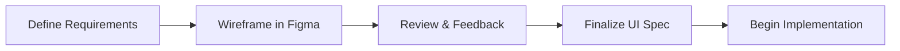
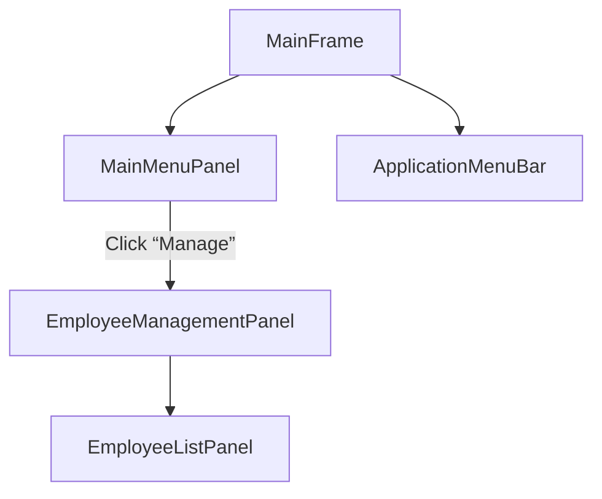
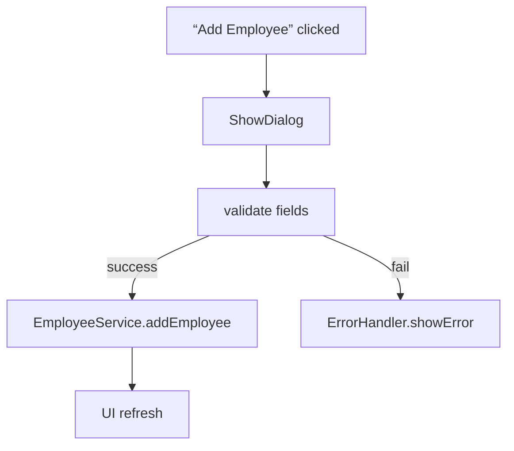
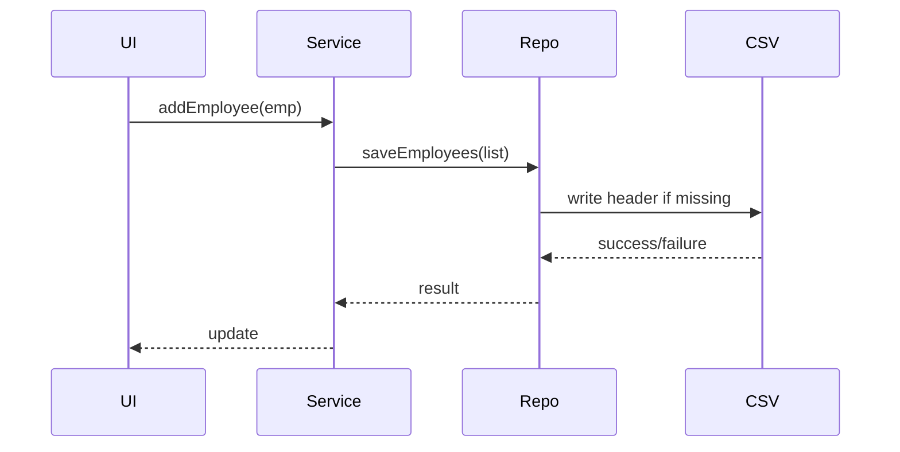

# The Journey from Concept to Payroll System: A Developer’s Tale in week 5 CHANGE REQUEST FORM – MPHCR02-Feature 2

---

## Prologue

Laboratory Work #4: MotorPH Payroll System with View and Create Record Functionalities.
A change request (MPHCR-02) was approved by the Change Control Board. This narrative chronicles the step-by-step process of fulfilling that request using Java Swing, OpenCSV, and team-based workflows.

---

## Chapter 1: Prototyping & Planning

Before writing any code, I sketched UI/UX wireframes in Figma, using a flexbox grid to arrange panels for “Employee List”, “Add Employee”, and “Details View.” With a clickable prototype, I gathered early feedback from peers.

Key resources:

- #file:planner.md (weekly breakdown, team roles, GitHub flow)
- #file:W5_MO-IT103 - Computer Programming 2.md (file-handling expectations)

Mermaid: Project Workflow



**Reflection:**
Early prototyping surfed through many layout ideas.  flexbox grid and peer reviews aligned everyone on color schemes and component placement before a single line of code.

---

## Chapter 2: UI Design in Java Swing

### Decision

- Use modular Swing panels (`MainMenuPanel`, `EmployeeListPanel`, `NewEmployeeDialog`).
- Centralize styling in UIConstants.java (#file:UIConstants.java) to match the Figma theme.

**Code Snippet: UIConstants.java**

```java
// ...existing code...
public static final Color PRIMARY_BG = new Color(34, 45, 68);
public static final Font HEADER_FONT = new Font("Segoe UI", Font.BOLD, 18);
// ...existing code...
```

Mermaid: UI Component Hierarchy



**Reflection:**
Extracting colors, fonts, and margins into `UIConstants` ensured consistency. Installing the modern look-and-feel and tweaking Swing defaults (via `UIManager`) bridged the gap between prototype and product.

---

## Chapter 3: Backend Integration

### Decision

- Implement a repository pattern (`DataRepository`, `CSVCreateAndWrite`).
- Adopt OpenCSV for parsing and writing, guided by #file:CSV_INTEGRATION_REPORT.md.

Mermaid: Data Flow


**Code Snippet: CSV Reading with OpenCSV**

```java
try (CSVReader reader = new CSVReader(new FileReader(path))) {
    List<String[]> rows = reader.readAll();
    // map rows to Employee objects
}
```

**Reflection:**
Mapping CSV rows to model objects uncovered subtle date-parsing issues. The detailed report in #file:CSV_INTEGRATION_REPORT.md provided patterns for `DateTimeFormatter`, smoothing out runtime errors.

---

## Chapter 4: Event Handling

### Decision

- Leverage lambda listeners for brevity.
- Validate inputs with InputValidator.java.

Mermaid: Add-Employee Event Flow



**Code Snippet: Button Listener**

```java
addButton.addActionListener(e -> {
    NewEmployeeDialog dlg = new NewEmployeeDialog();
    dlg.setVisible(true);
    if (dlg.isConfirmed()) {
        service.addEmployee(dlg.getEmployee());
        employeeListPanel.refresh();
    }
});
```

**Reflection:**
Wiring up events highlighted the need for synchronous UI updates. Centralizing error pop-ups via `ErrorHandler` prevented inconsistent dialogs across panels.

---

## Chapter 5: Data Persistence & Robust CSV Writing

### Decision

- Wrap file I/O in try-with-resources.
- Incorporate fixes from #file:CSV_WRITING_FIX_COMPLETE.md to handle empty files, headers, and concurrent access.

Mermaid: CSV Write Sequence



**Code Snippet: Safe CSV Write**

```java
try (CSVWriter writer = new CSVWriter(new FileWriter(path, false))) {
    writer.writeNext(headerRow);
    employees.forEach(emp -> writer.writeNext(emp.toCSVRow()));
} catch (IOException ex) {
    ErrorHandler.showError("CSV save failed: " + ex.getMessage());
}
```

**Reflection:**
Edge cases—like an empty CSV file or missing header—surfaced only during stress tests. The actionable tips in CSV_WRITING_FIX_COMPLETE.md directly led to stable write routines.

---

## Chapter 6: Testing & Quality Assurance

### Decision

- Use JUnit 5 for unit tests.
- Create isolated CSV fixtures so tests don’t clobber production data.

**Code Snippet: CSVWriteTest.java**

```java
@Test
void testWriteAndLoad() {
    Employee emp = new Employee("10010", "Smith", "Alice", ...);
    service.addEmployee(emp);
    List<Employee> loaded = repo.loadEmployees();
    assertTrue(loaded.contains(emp));
}
```

Mermaid: Testing Workflow


**Reflection:**
Writing tests exposed race conditions when tests ran in parallel. Switching to unique temp files per test solved collisions and ensured reproducibility.

---

## Chapter 7: Research & Collaboration

- Consulted #file:W5_MO-IT103 - Computer Programming 2.md for advanced file I/O patterns.
- Frequent sync-ups with the team (peer code reviews per #file:planner.md).
- Shared Figma links and demo screencasts to gather UI feedback.

**Reflection:**
Regular stand-ups and code reviews uncovered hidden assumptions—like date formats or CSV encoding—that would have caused bugs in production. Documentation and shared diagrams were invaluable.

---

## Final Chapter: Lessons Learned & Future Improvements

1. **Modularity Wins:** Decoupling UI, service, and repository layers accelerated parallel work.
2. **Centralized Styling:** `UIConstants` made theme updates trivial.
3. **Robust I/O:** OpenCSV plus explicit header handling prevented silent data loss.
4. **Automated Testing:** Early and isolated tests caught regressions in CSV routines.
5. **Collaboration:** Figma prototypes and weekly planner checkpoints kept the team aligned.

**Future Enhancements:**

- Migrate from CSV to a lightweight embedded database (H2) for transactional safety.
- Add authentication, role-based access, and audit logging.
- Modernize the UI with JavaFX or a web-based frontend for responsive design.
- Implement live-reload or file-watch to detect external CSV updates at runtime.

---

*End of Developer Journey – MPHCR-02 Feature 2 Complete*
