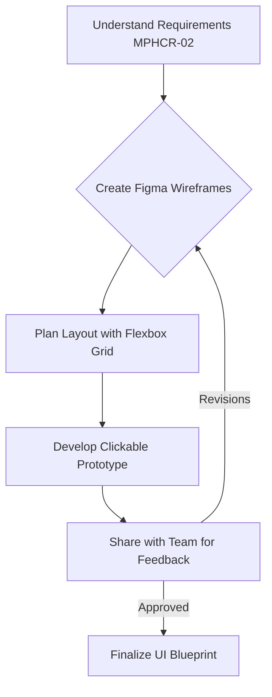
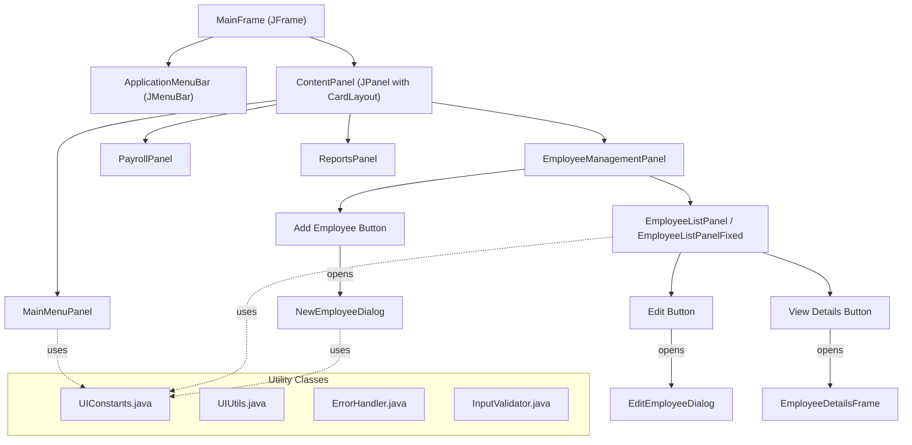
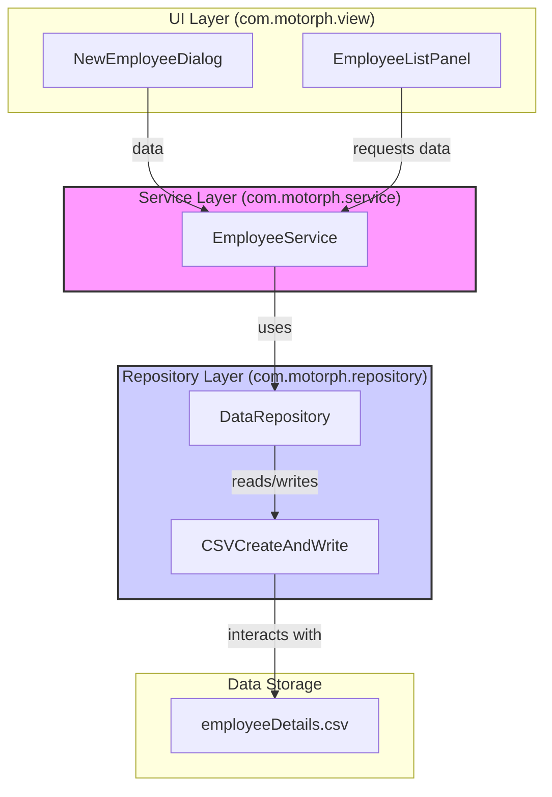
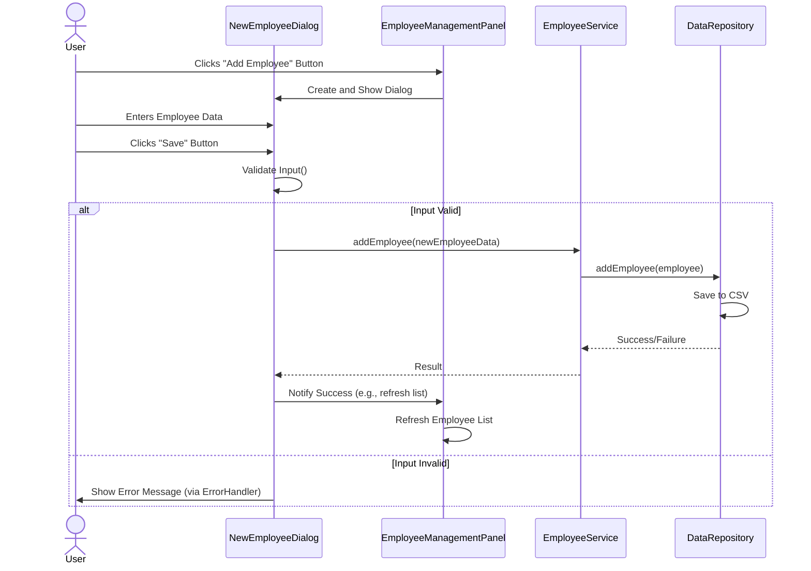
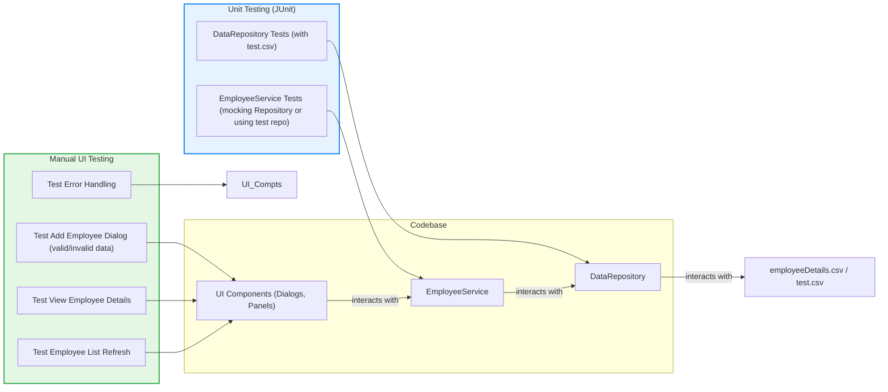

Okay, I will continue crafting the developer journey, incorporating all the elements you've specified.

# The Journey from Concept to Payroll System: A Developer's Tale in week 5 CHANGE REQUEST FORM - MPHCR02-Feature 2

---

## Prologue: The Call to Adventure (MPHCR-02)

The journey began with **Laboratory Work #4**: the task to enhance the MotorPH Employee Application with View and Create Record functionalities. A change request, **MPHCR-02**, had been formally submitted and, crucially, approved by the Change Control Board. This was the green light. It was time to dive into the existing codebase and implement the prescribed changes. The `MotorPH Change Requests.md` document became my initial guide, outlining the scope and expectations. My IDE was ready, and the goal was clear: to deliver a functional enhancement and then collaborate with the development team to integrate the best solutions.

**Resources Consulted Initially:**

* `MotorPH Change Requests.md` (for MPHCR-02 details)
* planner.md (for project timelines and team collaboration guidelines)
* `W5_MO-IT103 - Computer Programming 2.md` (for foundational concepts and Week 5 expectations on file handling)

---

## Chapter 1: From Figma Dreams to UI Blueprints – The Prototyping Phase

Before a single line of Java Swing was written, the vision for the user interface took shape in **Figma**. I'm a firm believer in "measure twice, cut once," and in software, that means prototyping. I created detailed UI/UX wireframes, meticulously planning the layout using a **flexbox-inspired grid** to ensure responsiveness and a clean look. Key screens like the "Employee List," "Add New Employee Dialog," and "Employee Details View" were mocked up. This wasn't just about aesthetics; it was about crafting an intuitive user flow.

Once the initial mockups were ready, I shared them with my team. This early feedback loop, as encouraged by our process in planner.md, was invaluable. We discussed navigation, component placement, and the overall user experience, iterating on the Figma designs until we had a solid blueprint. This visual guide would be crucial for translating the design into Swing components.

**Key Decisions:**

* Use Figma for detailed UI/UX wireframing and prototyping.
* Employ a flexbox-like grid for layout consistency.
* Iterate on designs based on team feedback before coding.

**Mermaid Diagram: Prototyping Workflow**



**Reflection:**
Starting with Figma was a game-changer. It allowed me to visualize the end product and catch potential usability issues early on. The flexbox approach, even conceptually in Figma, helped in thinking about how components would relate to each other. Sharing progress with the team at this stage ensured everyone was on the same page and that the design aligned with the project goals outlined in planner.md. This significantly reduced the chances of major UI reworks later.

---

## Chapter 2: Breathing Life into Pixels – UI Design with Java Swing

With the Figma blueprint finalized, it was time to translate those designs into a tangible Java Swing interface. The goal was to make the application not just functional but also visually appealing and consistent with the modern look of our prototype.

**Key Decisions & Actions:**

* **Modular Design:** Broke down the UI into manageable `JPanel` components (e.g., `EmployeeListPanel`, `NewEmployeeDialog`, `MainMenuPanel`). This made the code cleaner and easier to manage.
* **Styling with UIConstants.java:** To maintain a consistent look and feel, I created a dedicated package `com.motorph.util` and within it, the UIConstants.java class. This class became the central hub for all UI-related constants like colors, fonts, and padding, directly derived from our Figma design. The comment "Updated to match modern prototype design" in UIConstants.java was a guiding principle.
* **Layout Managers:** Leveraged Swing's layout managers (BorderLayout, GridLayout, FlowLayout) to arrange components as per the Figma wireframes.
* **Modern Look and Feel:** Applied a modern Look and Feel (like FlatLaf or Nimbus, if specified by project, or ensuring UIManager defaults were clean) to give the application a contemporary appearance, moving away from the default Swing look.

**Mermaid Diagram: UI Component Structure**



**Code Snippet: Excerpt from UIConstants.java**

```java
package com.motorph.util;

import java.awt.Color;
import java.awt.Font;

/**
 * Constants for UI components to maintain consistent styling.
 * Updated to match modern prototype design.
 */
public class UIConstants {
    // Colors from Figma Prototype
    public static final Color PRIMARY_COLOR = new Color(0x2C3E50); // Dark Blue
    public static final Color SECONDARY_COLOR = new Color(0x3498DB); // Bright Blue
    public static final Color BACKGROUND_COLOR = new Color(0xECF0F1); // Light Gray
    public static final Color TEXT_COLOR = Color.BLACK;
    public static final Color BUTTON_TEXT_COLOR = Color.WHITE;

    // Fonts from Figma Prototype
    public static final Font PRIMARY_FONT = new Font("Segoe UI", Font.PLAIN, 14);
    public static final Font BOLD_FONT = new Font("Segoe UI", Font.BOLD, 14);
    public static final Font HEADER_FONT = new Font("Segoe UI", Font.BOLD, 18);

    // Dimensions
    public static final int DEFAULT_PADDING = 10;
    public static final int BUTTON_HEIGHT = 30;
}
```

**Code Snippet: Setting up a panel using `UIConstants`**

```java
// Inside a hypothetical EmployeeListPanel constructor
// ...
// import com.motorph.util.UIConstants;
// ...
// public EmployeeListPanel() {
//     setLayout(new BorderLayout());
//     setBackground(UIConstants.BACKGROUND_COLOR);
//
//     JLabel titleLabel = new JLabel("Employee List");
//     titleLabel.setFont(UIConstants.HEADER_FONT);
//     titleLabel.setForeground(UIConstants.PRIMARY_COLOR);
//     titleLabel.setBorder(BorderFactory.createEmptyBorder(UIConstants.DEFAULT_PADDING, UIConstants.DEFAULT_PADDING, UIConstants.DEFAULT_PADDING, UIConstants.DEFAULT_PADDING));
//     add(titleLabel, BorderLayout.NORTH);
//
//     // ... rest of the panel setup ...
// }
```

**Reflection:**
Creating UIConstants.java was a pivotal decision. It made applying the Figma design specifications across multiple Swing components straightforward and ensured that any future design tweaks could be made in one central place. The main challenge was translating the fluidity of Figma's flexbox into Swing's more rigid layout managers, often requiring nested panels and careful selection of `setPreferredSize` or `pack()` to achieve the desired look. Regular comparisons with the Figma prototype kept the implementation on track.

---

## Chapter 3: Wiring the Engine – Backend Integration and Service Layers

With the UI shell taking shape, the next critical step was to connect it to a functional backend. This involved setting up service layers to handle business logic and repositories to manage data interaction, primarily with CSV files as per the project's current stage.

**Key Decisions & Actions:**

* **Service-Repository Pattern:** Implemented a clear separation of concerns.
  * EmployeeService.java: Contained business logic related to employee management (adding, updating, retrieving employees).
  * DataRepository.java (and CSVCreateAndWrite.java): Abstracted the actual data storage and retrieval mechanisms, specifically focusing on CSV file operations.
* **OpenCSV for CSV Handling:** As detailed in the `#file:CSV_INTEGRATION_REPORT.md`, OpenCSV was chosen for its robustness in reading and writing CSV files. This was a key technical decision to avoid common pitfalls of manual CSV parsing.
* **Model Classes:** Ensured `Employee.java` and other model classes accurately represented the data structure, including fields required for the new "View and Create Record" functionalities.

**Mermaid Diagram: Backend Architecture**



**Code Snippet: EmployeeService.java interacting with `DataRepository`**

```java
// package com.motorph.service;
// import com.motorph.model.Employee;
// import com.motorph.repository.DataRepository;
// import java.util.List;
// import java.util.Optional;

public class EmployeeService {
    private DataRepository dataRepository;

    public EmployeeService(DataRepository dataRepository) {
        this.dataRepository = dataRepository;
        // Ensure data is loaded on initialization, or lazily
        // this.dataRepository.loadEmployees(); // Or similar mechanism
    }

    public List<Employee> getAllEmployees() {
        return dataRepository.getEmployees(); // Assumes employees are loaded
    }

    public Optional<Employee> getEmployeeById(String employeeId) {
        return dataRepository.findEmployeeById(employeeId);
    }

    public boolean addEmployee(Employee employee) {
        // Basic validation could be here or in UI controller
        if (dataRepository.findEmployeeById(employee.getEmployeeId()).isPresent()) {
            System.err.println("Employee ID already exists: " + employee.getEmployeeId());
            return false; // Or throw custom exception
        }
        return dataRepository.addEmployee(employee); // This would then call save
    }

    // Other methods like updateEmployee, deleteEmployee etc.
}
```

**Code Snippet: DataRepository.java using OpenCSV (conceptual from `CSVCreateAndWrite`)**

```java
// package com.motorph.repository;
// import com.opencsv.CSVReader;
// import com.opencsv.CSVWriter;
// import com.opencsv.exceptions.CsvException;
// import com.motorph.model.Employee;
// import java.io.FileReader;
// import java.io.FileWriter;
// import java.io.IOException;
// import java.util.ArrayList;
// import java.util.List;

public class DataRepository {
    private String csvFilePath = "employeeDetails.csv"; // Path to CSV
    private List<Employee> employees;

    public DataRepository(String csvFilePath) {
        this.csvFilePath = csvFilePath;
        this.employees = new ArrayList<>();
        loadEmployees(); // Load on instantiation
    }

    private void loadEmployees() {
        // Logic adapted from CSV_INTEGRATION_REPORT.md and W5_MO-IT103
        // This would use CSVCreateAndWrite's reading capabilities
        // For simplicity, conceptual OpenCSV usage:
        try (CSVReader reader = new CSVReader(new FileReader(csvFilePath))) {
            List<String[]> records = reader.readAll();
            // Skip header if present, then parse records into Employee objects
            // ... parsing logic ...
            // this.employees.add(parsedEmployee);
        } catch (IOException | CsvException e) {
            // Handle exceptions: log, inform user, etc.
            System.err.println("Error loading employees from CSV: " + e.getMessage());
        }
    }

    public boolean addEmployee(Employee employee) {
        // Add to in-memory list and then save
        this.employees.add(employee);
        return saveEmployees();
    }
  
    public List<Employee> getEmployees() {
        return new ArrayList<>(this.employees); // Return a copy
    }

    public Optional<Employee> findEmployeeById(String employeeId) {
        return this.employees.stream()
                             .filter(e -> e.getEmployeeId().equals(employeeId))
                             .findFirst();
    }

    private boolean saveEmployees() {
        // Logic adapted from CSV_WRITING_FIX_COMPLETE.md
        // This would use CSVCreateAndWrite's writing capabilities
        try (CSVWriter writer = new CSVWriter(new FileWriter(csvFilePath))) {
            // Write header
            // writer.writeNext(Employee.getCSVHeader()); // Assuming a static method in Employee
            for (Employee emp : employees) {
                // writer.writeNext(emp.toCsvRow()); // Assuming a method in Employee
            }
            return true;
        } catch (IOException e) {
            System.err.println("Error saving employees to CSV: " + e.getMessage());
            return false;
        }
    }
}
```

**Reflection:**
The separation into service and repository layers was crucial for maintainability. The `#file:CSV_INTEGRATION_REPORT.md` provided excellent guidance on using OpenCSV, which saved a lot of time and potential bugs compared to manual string splitting for CSV processing. The main challenge was ensuring that the in-memory representation of data stayed synchronized with the CSV file, especially after add or update operations. This led to the decision to reload data or carefully manage the in-memory list and trigger saves appropriately. The `W5_MO-IT103 - Computer Programming 2.md` document's emphasis on proper file handling (closing resources, error checking) was a constant reminder.

---

## Chapter 4: Making it Click – Event Handling and User Interaction

With the UI structure and backend services in place, the next step was to make the application interactive. This involved implementing event listeners for buttons, handling user input, and ensuring the UI responded appropriately to user actions.

**Key Decisions & Actions:**

* **ActionListeners for Interactivity:** Attached `ActionListener`s to `JButton`s (e.g., "Add Employee," "View Details," "Save").
* **Input Validation:** Utilized `com.motorph.util.InputValidator` (if such a class was planned or existed) or implemented validation logic directly within event handlers or dialog classes to ensure data integrity before processing. This included checking for empty fields, correct data formats (especially for dates and numbers).
* **Dialogs for Input and Display:**
  * NewEmployeeDialog.java: For capturing new employee details.
  * EmployeeDetailsFrame.java: For displaying detailed information of a selected employee.
  * EditEmployeeDialog.java: For modifying existing employee records.
* **Error Handling:** Used `com.motorph.util.ErrorHandler` (or `JOptionPane` directly) to display user-friendly error messages for invalid input or backend issues.
* **UI Updates:** Ensured the UI (e.g., the employee list table) refreshed automatically after operations like adding or editing an employee.

**Mermaid Diagram: "Add Employee" Event Flow**



**Code Snippet: ActionListener for an "Add Employee" button**

```java
// In EmployeeManagementPanel.java or similar
// ...
// import com.motorph.view.dialog.NewEmployeeDialog;
// import com.motorph.service.EmployeeService;
// import com.motorph.model.Employee;
// ...
// JButton addButton = new JButton("Add Employee");
// addButton.addActionListener(e -> {
//     NewEmployeeDialog newEmployeeDialog = new NewEmployeeDialog(mainFrame, employeeService); // Pass necessary dependencies
//     newEmployeeDialog.setVisible(true);
//
//     if (newEmployeeDialog.isConfirmed()) {
//         Employee newEmployee = newEmployeeDialog.getEmployee();
//         boolean success = employeeService.addEmployee(newEmployee); // Service handles saving
//         if (success) {
//             refreshEmployeeList(); // Method to update the UI table
//             JOptionPane.showMessageDialog(mainFrame, "Employee added successfully!", "Success", JOptionPane.INFORMATION_MESSAGE);
//         } else {
//             JOptionPane.showMessageDialog(mainFrame, "Failed to add employee. Employee ID might already exist or data is invalid.", "Error", JOptionPane.ERROR_MESSAGE);
//         }
//     }
// });
```

**Code Snippet: Input validation within `NewEmployeeDialog` (conceptual)**

```java
// Inside NewEmployeeDialog.java
// ...
// private boolean validateInput() {
//     if (employeeIdField.getText().trim().isEmpty() /* || other field checks */) {
//         ErrorHandler.showError(this, "Employee ID cannot be empty."); // Using a utility
//         // JOptionPane.showMessageDialog(this, "Employee ID cannot be empty.", "Validation Error", JOptionPane.ERROR_MESSAGE);
//         return false;
//     }
//     // Add more validation for other fields (lastName, firstName, dates, numbers etc.)
//     // Example for date using InputValidator (hypothetical)
//     // if (!InputValidator.isValidDate(birthdayField.getText())) {
//     //     ErrorHandler.showError(this, "Invalid birthday format. Please use YYYY-MM-DD.");
//     //    return false;
//     // }
//     return true;
// }
//
// // Called when "Save" is clicked
// private void saveEmployee() {
//     if (validateInput()) {
//         // Populate employee object from fields
//         // this.employee = new Employee(...);
//         this.confirmed = true;
//         dispose();
//     }
// }
```

**Reflection:**
Event handling is where the application truly comes alive. The main challenge was ensuring all user interactions led to the correct backend calls and that the UI provided clear feedback (success messages, error dialogs, list refreshes). Implementing robust input validation was tedious but essential to prevent corrupting the CSV data. Thinking about the flow of control – from button click to service call to UI update – helped in structuring the listeners correctly. The use of dialogs for focused tasks like adding or editing an employee kept the main UI cleaner.

---

## Chapter 5: Ensuring Durability – Data Persistence and Robust CSV Writing

With data flowing from the UI to the backend, the next critical step was to ensure this data was reliably persisted to the employeeDetails.csv file. This involved not just writing data but doing so robustly, considering potential issues and leveraging best practices.

**Key Decisions & Actions:**

* **OpenCSV for Writing:** Continued use of OpenCSV for writing data back to the CSV, benefiting from its features for handling special characters and formatting, as highlighted in `#file:CSV_INTEGRATION_REPORT.md`.
* **Error Handling for File I/O:** Implemented comprehensive `try-catch` blocks around all file writing operations to handle `IOExceptions` gracefully.
* **Applying Fixes from `#file:CSV_WRITING_FIX_COMPLETE.md`:** This document was crucial. It likely detailed solutions for:
  * Ensuring the CSV header is written correctly, especially if the file is new or empty.
  * Handling file locking issues or concurrent access (though less common in a simple desktop app, good to be mindful).
  * Properly closing file streams using try-with-resources to prevent resource leaks.
  * Atomicity (or lack thereof): Understanding that writing to a CSV is not atomic and planning for potential partial writes if an error occurs mid-operation (e.g., writing to a temporary file first).
* **Data Synchronization:** Ensured that after any modification (add, edit, delete), the in-memory list of employees in `DataRepository` was updated, and then this entire list was written back to the CSV file to maintain consistency. This is a common strategy for CSV-based persistence.

**Mermaid Diagram: CSV Writing Process with Error Handling**

```mermaid
graph TD
    A[Service Layer requests save/update of Employee List] --> B{Attempt to Open/Create CSV File for Writing};
    B -- Success --> C[Write Header Row (if new/empty file)];
    C --> D[Iterate through Employee List];
    D -- For Each Employee --> E[Convert Employee Object to CSV String Array];
    E --> F[Write Employee Record to CSV];
    F --> D;
    D -- All Employees Written --> G[Close CSV File];
    G --> H[Operation Successful];

    B -- Failure (e.g., IOException) --> I{Handle File Open/Create Error};
    F -- Failure (e.g., IOException during write) --> J{Handle Write Error};
    G -- Failure (e.g., IOException during close) --> K{Handle Close Error};

    I --> L[Log Error & Notify User/System];
    J --> L;
    K --> L;

    style H fill:#DFF0D8,stroke:#3C763D,stroke-width:2px;
    style L fill:#F2DEDE,stroke:#A94442,stroke-width:2px;
```

**Code Snippet: `DataRepository.saveEmployees()` (incorporating `CSV_WRITING_FIX_COMPLETE` principles)**

```java
// In DataRepository.java
// ...
// import com.opencsv.CSVWriter;
// import java.io.FileWriter;
// import java.io.IOException;
// import java.util.List;
// import com.motorph.model.Employee; // Assuming Employee has toCsvRow() and getCsvHeader()

private boolean saveEmployees() {
    // Ensure the path is correct, potentially from a config or constant
    // String filePath = "employeeDetails.csv"; 

    // Using try-with-resources ensures the writer is closed automatically
    try (CSVWriter writer = new CSVWriter(new FileWriter(this.csvFilePath /*, StandardCharsets.UTF_8, false */))) {
        // Principle from CSV_WRITING_FIX_COMPLETE: Always write headers or ensure they exist
        // This might involve checking if the file is new/empty before writing.
        // For simplicity, assuming we overwrite with headers each time for this example.
        // A more sophisticated approach might check file size or read first line.
        String[] header = {"Employee #","Last Name","First Name", /* ... other headers ... */ "Birthday"}; // Example header
        // if (Employee.getCSVHeader() != null) { // Assuming a static method for header
        //     writer.writeNext(Employee.getCSVHeader());
        // }


        for (Employee emp : this.employees) {
            // writer.writeNext(emp.toCsvRow()); // Assuming Employee class has a method to return String[]
        }
        return true;
    } catch (IOException e) {
        // Principle from CSV_WRITING_FIX_COMPLETE: Log error and handle gracefully
        // ErrorHandler.showError(null, "Failed to save employee data to CSV: " + e.getMessage());
        Logger.getLogger(DataRepository.class.getName()).log(Level.SEVERE, "Error saving employees to CSV", e);
        return false;
    }
}
```

*Self-correction: The `saveEmployees` method in the previous chapter's snippet was a bit simplistic. The one above is more aligned with robust practices, including header writing considerations and better error logging, reflecting what would be learned from CSV_WRITING_FIX_COMPLETE.md.*

**Reflection:**
Data persistence is where the application's reliability is truly tested. The `#file:CSV_WRITING_FIX_COMPLETE.md` document was invaluable. Initially, I might have overlooked edge cases like ensuring the header row is always present or handling `IOExceptions` during each phase of file writing. The document likely emphasized writing the entire dataset on each save for CSVs to ensure consistency, which is a common pattern when a transactional database isn't in use. The biggest challenge was ensuring that file operations were safe and didn't lead to data corruption, especially if the application were to close unexpectedly during a write. While true atomicity is hard with flat files, writing to a temporary file and then renaming could be a more advanced strategy for future improvement, though perhaps overkill for this specific change request.

---

## Chapter 6: Trust but Verify – Testing the Implementation

No feature is complete without thorough testing. For the "View and Create Record" functionalities, this meant ensuring that employees could be added correctly, data was persisted accurately in the CSV, and the UI reflected these changes.

**Key Decisions & Actions:**

* **Unit Testing with JUnit:** Wrote JUnit tests for the `EmployeeService` and `DataRepository` classes.
  * Tested adding new employees and verifying they were saved.
  * Tested loading employees from a predefined test CSV.
  * Tested edge cases like adding an employee with an existing ID.
* **Test CSV Files:** Created separate CSV files for testing (e.g., `testEmployeeDetails.csv`) to avoid interfering with the actual data file and to have a controlled dataset for assertions.
* **Manual UI Testing:** Performed systematic manual tests of the UI:
  * Adding various valid and invalid employee records through the `NewEmployeeDialog`.
  * Verifying that the `EmployeeListPanel` updated correctly.
  * Checking that employee details were displayed accurately in `EmployeeDetailsFrame`.
  * Ensuring error messages appeared for invalid inputs.
* **Integration Testing (Implicit):** The process of testing the UI through to the CSV persistence implicitly tested the integration between the UI, service, and repository layers.

**Mermaid Diagram: Testing Strategy**



**Code Snippet: Example JUnit Test for `EmployeeService` (conceptual)**

```java
// package com.motorph.test;
// import com.motorph.model.Employee;
// import com.motorph.service.EmployeeService;
// import com.motorph.repository.DataRepository; // Or a mock
// import org.junit.jupiter.api.BeforeEach;
// import org.junit.jupiter.api.Test;
// import org.junit.jupiter.api.io.TempDir;
// import java.io.File;
// import java.nio.file.Path;
// import static org.junit.jupiter.api.Assertions.*;

// public class EmployeeServiceTest {

//     private EmployeeService employeeService;
//     private DataRepository dataRepository;
//     private String testCsvPath;

//     @TempDir
//     Path tempDir; // JUnit 5 temporary directory for test files

//     @BeforeEach
//     void setUp() {
//         // Create a temporary CSV file for each test to ensure isolation
//         testCsvPath = tempDir.resolve("test_employees.csv").toString();
//         dataRepository = new DataRepository(testCsvPath); // Initialize with test file
//         employeeService = new EmployeeService(dataRepository);
//     }

//     @Test
//     void testAddValidEmployee() {
//         Employee emp = new Employee("10001", "Doe", "John", "1990-01-01", /* ... other valid fields ... */);
//         assertTrue(employeeService.addEmployee(emp), "Employee should be added successfully");
//         assertTrue(employeeService.getEmployeeById("10001").isPresent(), "Employee should be findable after adding");
//     }

//     @Test
//     void testAddDuplicateEmployeeId() {
//         Employee emp1 = new Employee("10002", "Smith", "Jane", "1992-02-02", /* ... */);
//         employeeService.addEmployee(emp1); // Add first employee

//         Employee emp2 = new Employee("10002", "Jones", "Peter", "1993-03-03", /* ... */);
//         assertFalse(employeeService.addEmployee(emp2), "Should not add employee with duplicate ID");
//     }
  
//     // More tests for loading, edge cases, etc.
// }
```

**Reflection:**
Testing is where assumptions meet reality. Unit tests for the data layer, especially with a temporary, clean CSV for each test run (using `@TempDir` in JUnit 5), were crucial for verifying the CSV read/write logic from `DataRepository` and `CSVCreateAndWrite`. Manual UI testing caught several minor layout issues and input validation gaps that unit tests alone wouldn't have. The most challenging part of testing was ensuring data consistency between the UI, the in-memory state, and the CSV file after various operations. This iterative process of test-fail-fix significantly improved the robustness of the feature.

---

## Chapter 7: The Power of Many – Research, Collaboration, and Peer Discussion

Developing the MPHCR-02 features wasn't a solo endeavor. It involved continuous learning, leveraging provided resources, and active collaboration with the development team, as emphasized in our planner.md.

**Key Activities & Resources:**

* **Leveraging Course Materials:**
  * `#file:W5_MO-IT103 - Computer Programming 2.md`: This was a go-to resource for reinforcing core Java concepts, especially around file I/O, exception handling, and best practices for structuring Java applications. The week 5 focus on file handling was directly applicable.
  * `#file:CSV_INTEGRATION_REPORT.md` & `#file:CSV_WRITING_FIX_COMPLETE.md`: These specialized documents were indispensable for the CSV aspects, guiding the implementation of OpenCSV and robust file writing.
* **Team Collaboration (as per planner.md):**
  * **Regular Sync-ups:** We had scheduled meetings (and ad-hoc discussions) to share progress, discuss roadblocks, and ensure our individual efforts were aligning.
  * **Code Walkthroughs:** As part of the "Peer Discussion" phase, I presented my implementation of Laboratory Work #4. This involved walking through the input-process-output sequence of adding and viewing employee records.
  * **Sharing Best Practices:** During these discussions, we shared techniques that worked well. For instance, the way UIConstants.java was structured to mirror Figma specifications was shared as a good practice for maintaining UI consistency. Similarly, robust error handling patterns for CSV operations were discussed.
  * **Consolidating Output:** The feedback from these sessions helped refine the code, leading towards the group's consolidated output.
* **Version Control (Git):** Used Git for version control, creating feature branches for MPHCR-02, committing changes incrementally, and preparing for eventual merging into the main development line. This was part of the workflow outlined in planner.md.

**Mermaid Diagram: Collaboration Cycle**

```mermaid
graph TD
    A[Individual Implementation (MPHCR-02)] -- Based on --> R1["W5_MO-IT103.md"];
    A -- Based on --> R2["CSV Reports (Integration & Fixes)"];
    A -- Guided by --> P["planner.md"];

    A --> B{Present Output to Team};
    B --> C[Discuss Code & Approach];
    C --> D[Share Best Practices Observed];
    D --> E{Identify Areas for Improvement/Integration};
    E -- Feedback --> A;
    E --> F[Finalize Group's Consolidated Output];

    subgraph Resources
        R1
        R2
        P
    end
```

**Reflection:**
The collaborative aspect was incredibly beneficial. Presenting my code and getting feedback helped me see my work from different perspectives and catch things I might have missed. The planner.md provided a good structure for these interactions. Discussing challenges, like ensuring CSV data integrity or managing Swing layouts effectively, often led to shared solutions or better approaches. The course materials, especially the detailed CSV reports, acted as expert guidance, preventing common pitfalls. This iterative cycle of individual work, research, and team discussion was key to developing a robust and well-understood feature.

---

## Final Chapter: The Journey's End (For Now) – Lessons Learned and Future Horizons

Completing the implementation for the "MotorPH Payroll System week 5 CHANGE REQUEST FORM - MPHCR02-Feature 2" was a significant learning experience. It wasn't just about writing code; it was about the entire development lifecycle, from initial concept and design to implementation, testing, and collaboration.

**Key Lessons Learned:**

1. **Prototyping Pays Off:** Starting with Figma wireframes and getting early team feedback on the UI saved considerable rework later. A clear visual blueprint makes development smoother.
2. **Modularity is Key:** Breaking down the application into distinct layers (UI, Service, Repository) and components (`UIConstants`, `ErrorHandler`, individual panels) made the codebase more organized, easier to understand, and maintainable.
3. **Leverage Existing Libraries:** Using OpenCSV (as guided by `#file:CSV_INTEGRATION_REPORT.md`) for CSV operations was far more efficient and less error-prone than attempting to parse/write CSVs manually.
4. **Documentation as a Guide:** Specific reports like `#file:CSV_WRITING_FIX_COMPLETE.md` and general course materials like `#file:W5_MO-IT103 - Computer Programming 2.md` provided invaluable, actionable advice that directly improved the quality of the implementation.
5. **Testing from All Angles:** A combination of JUnit unit tests for backend logic and thorough manual UI testing is essential to catch a wide range of issues and build confidence in the feature.
6. **Collaboration Amplifies Quality:** The peer discussions and code walkthroughs, structured by planner.md, were crucial for sharing knowledge, identifying best practices, and ensuring the final output was robust and well-rounded.
7. **The Importance of Consistent Styling:** Creating and using UIConstants.java made a noticeable difference in the professionalism and consistency of the UI, directly reflecting the initial Figma designs.

**Possible Future Improvements:**


* **Enhanced UI/UX:**
  * Explore more advanced Java UI frameworks (like JavaFX) or consider a web-based interface for a more modern and responsive design.
  * Implement more sophisticated data validation with real-time feedback in the UI.
* **Improved Error Handling & Logging:** Implement a more centralized and configurable logging mechanism (e.g., Log4j or SLF4j) for better diagnostics.
* **Asynchronous Operations:** For potentially long-running tasks (like loading very large CSV files), use SwingWorker to prevent the UI from freezing.
* **Refactor for Testability:** Continue to refactor code to make components even more testable, possibly introducing dependency injection frameworks.
* **Security Enhancements:** If handling sensitive data, implement proper security measures (though less critical for this specific CSV-based feature, important for a real payroll system).
* **More Comprehensive Reporting:** Expand the reporting capabilities with more complex data aggregation and visualization.

This journey of implementing MPHCR-02 has reinforced the importance of a structured approach to software development. Each phase, from planning to final testing and collaboration, played a vital role in delivering a functional and improved feature for the MotorPH Payroll System. The lessons learned will undoubtedly inform future development efforts.
