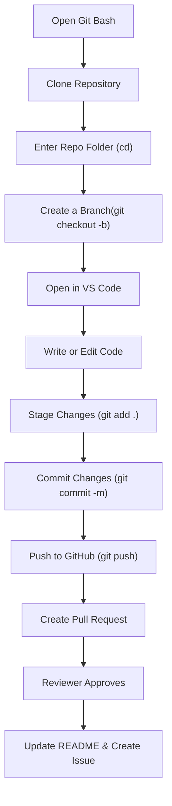

## 📌 GitHub Workflow Guide (Beginner-Friendly)

> This guide will walk you through how to  **copy a GitHub repository** ,  **create your own working branch** ,  **make changes** ,  **commit your code** , and **push it back to GitHub** for collaboration.

We'll be working with this repository:

🔗 [https://github.com/joembolinas/CP2_GROUP-4.git](https://github.com/joembolinas/CP2_GROUP-4)

**This repo will be used for the entire project—from start to finish.**

---

## 🧾 Summary Table

| Step | Action                       | Command/Instruction                                          | Notes                                    |
| ---- | ---------------------------- | ------------------------------------------------------------ | ---------------------------------------- |
| 1    | Open Git Bash                | –                                                           | Use it as your terminal                  |
| 2    | Clone the Repo               | `git clone https://github.com/joembolinas/CP2_GROUP-4.git` | Copies the repo to your local PC         |
| 3    | Access the Folder            | `cd CP2_GROUP-4`                                           | Move into the cloned folder              |
| 4    | Create a Branch              | `git checkout -b yourname-taskname`                        | Your branch name should reflect the task |
| 5    | Open VS Code                 | `code .`                                                   | Opens the folder in VS Code              |
| 6    | Stage Changes                | `git add .`                                                | Prepares your changes for commit         |
| 7    | Commit Changes               | `git commit -m "Meaningful message"`                       | Describe what you did                    |
| 8    | Push Branch                  | `git push origin yourname-taskname`                        | Sends your branch to GitHub              |
| 9    | Create Pull Request          | –                                                           | Done on GitHub web UI                    |
| 10   | Update README & Create Issue | –                                                           | Helps document your progress             |

---

## 🪜 Step-by-Step Instructions

### 🔁 From GitHub to Local Machine

#### 1. Open Git Bash

Start by opening **Git Bash** on your computer. This is your terminal to run Git commands.

#### 2. Clone the Repository

Copy the GitHub repository to your computer:

```bash
git clone https://github.com/joembolinas/CP2_GROUP-4.git
```

This saves the project folder in your user directory, e.g., `C:/Users/YourName/CP2_GROUP-4`.

#### 3. Enter the Repository

Navigate into the folder:

```bash
cd CP2_GROUP-4
```

#### 4. Create a New Branch

Create your own branch where you can safely work:

```bash
git checkout -b yourname-taskname
```

**Example:** `git checkout -b joem-login-feature`

> ✅ This helps separate your work from the main branch.

#### 5. Open in Visual Studio Code

If you have VS Code installed, open the folder using:

```bash
code .
```

---

### ✏️ After Coding – Save and Commit

After editing or adding code in VS Code, do the following:

#### 6. Stage the Changes

```bash
git add .
```

#### 7. Commit the Changes

```bash
git commit -m "Add login feature for user authentication"
```

> ✍🏻 Your message should clearly describe what you’ve done.

---

### ❓ When Should I Commit?

Every time you:

* Finish a small task
* Reach a milestone
* Want to back up your progress

> 🧠 It’s a good habit to commit  **early and often** . This helps track your progress and makes it easier to troubleshoot issues later.

---

### 🚀 Push Your Branch to GitHub

Once you're ready to share your work:

```bash
git push origin yourname-taskname
```

---

### ✅ Create a Pull Request (PR)

1. Go to the GitHub repo on the browser.
2. You’ll see a prompt to **compare & pull request** after pushing.
3. Add a title and description, then click  **Create Pull Request** .

This will notify the **mentor or reviewer** to check your work. If it aligns with the project scope, they’ll approve it.

---

### 🧾 Document Changes

After your PR:

* 📘 **Update the README** if your feature affects the documentation.
* 🐞 **Create an Issue** to track the change (tagged with appropriate labels).
* 👤 **Assign the issue to the mentor or teammate** for reference.

---

## 🔄 Visual Workflow



---

## 🧑‍🏫 Pro Tips for Beginners

* Use meaningful branch and commit names.
* Keep your branch **up-to-date** by pulling from `main` regularly.
* Always double-check your code before pushing.
* Use VS Code’s **Source Control** tab for a visual way to manage commits.

---


### 🔁 From GitHub to Cloud Access
